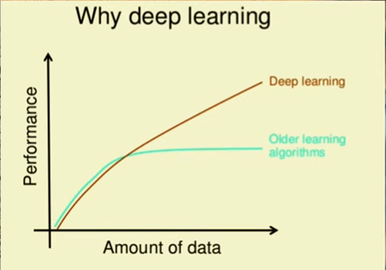

# AI vs ML vs DL for Beginners

---

## 🧠 1. Artificial Intelligence (AI)
.png)
:contentReference[oaicite:0]{index=0} is the **big umbrella field**.

It means:  
> Making machines act like humans (thinking, reasoning, solving problems, making decisions).

### Examples:
- Chatbots
- Self-driving cars
- Game-playing AI (like chess engines)

👉 AI can work in two ways:
- Rule-based systems (old style: if-else logic)
- Learning systems (modern approach → ML)

---

## 📊 2. Machine Learning (ML)
.png)
:contentReference[oaicite:1]{index=1} is a **subset of AI**.

It means:  
> Instead of hardcoding rules, we give data and the machine learns patterns from it.

### Examples:
- Netflix recommending movies
- Spam email detection
- Predicting house prices

👉 ML = “learn from data”

Types of ML:
- Supervised learning (labeled data)
- Unsupervised learning (hidden patterns)
- Reinforcement learning (learning from rewards)

---

## 🧠⚡ 3. Deep Learning (DL)

:contentReference[oaicite:2]{index=2} is a **subset of Machine Learning**.

It means:  
> Using multi-layered neural networks (like a simplified brain) to learn complex patterns.

### Examples:
- Face recognition (phone unlock)
- Voice assistants (Siri, Google Assistant)
- AI image generators

👉 DL = “ML with neural networks + lots of data + powerful computers”

---

## 🔥 Simple Relationship

