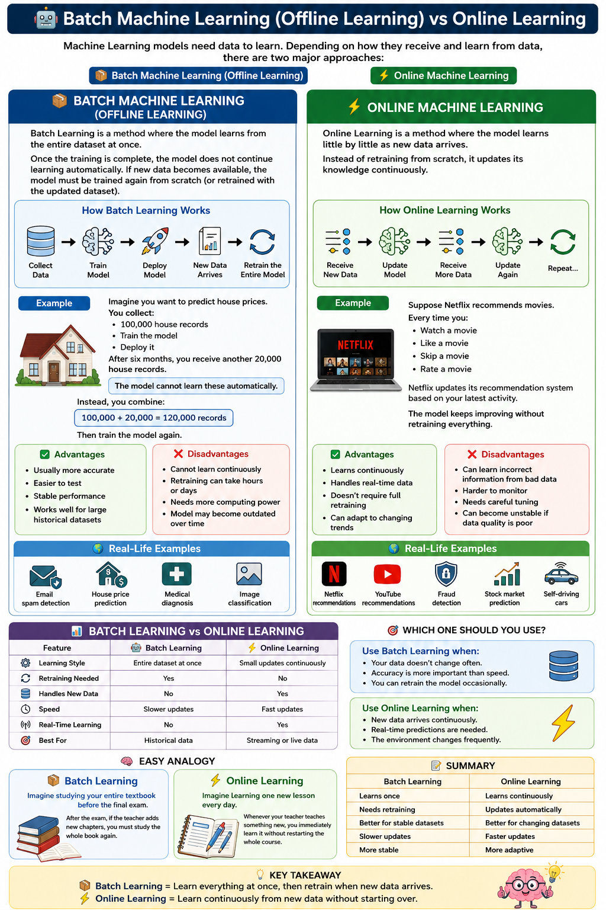

# 🤖 Batch Machine Learning (Offline Learning) vs Online Learning

Machine Learning models need data to learn. Depending on **how they receive and learn from data**, there are two major approaches:

- 📦 Batch Machine Learning (Offline Learning)
- ⚡ Online Machine Learning

---

# 📦 Batch Machine Learning (Offline Learning)

Batch Learning is a method where the model learns from **the entire dataset at once**.

Once the training is complete, the model **does not continue learning automatically**. If new data becomes available, the model must be trained **again from scratch** (or retrained with the updated dataset).

Think of it like studying an entire textbook before taking an exam.

---

## How Batch Learning Works

```text
Collect Data
      │
      ▼
Train Model
      │
      ▼
Deploy Model
      │
      ▼
New Data Arrives
      │
      ▼
Retrain the Entire Model
```

---

## Example

Imagine you want to predict house prices.

You collect:

- 100,000 house records
- Train the model
- Deploy it

After six months, you receive another 20,000 house records.

The model **cannot learn these automatically.**

Instead, you combine:

```
100,000 + 20,000 = 120,000 records
```

Then train the model again.

---

## Advantages

- ✅ Usually more accurate
- ✅ Easier to test
- ✅ Stable performance
- ✅ Works well for large historical datasets

---

## Disadvantages

- ❌ Cannot learn continuously
- ❌ Retraining can take hours or days
- ❌ Needs more computing power
- ❌ Model may become outdated over time

---

## Real-Life Examples

- Email spam detection
- House price prediction
- Medical diagnosis
- Image classification

---

# ⚡ Online Machine Learning

Online Learning is a method where the model learns **little by little** as new data arrives.

Instead of retraining from scratch, it updates its knowledge continuously.

Think of it like learning something new every day instead of reading an entire book at once.

---

## How Online Learning Works

```text
Receive New Data
        │
        ▼
Update Model
        │
        ▼
Receive More Data
        │
        ▼
Update Again
        │
        ▼
Repeat...
```

---

## Example

Suppose Netflix recommends movies.

Every time you:

- Watch a movie
- Like a movie
- Skip a movie
- Rate a movie

Netflix updates its recommendation system based on your latest activity.

The model keeps improving without retraining everything.

---

## Advantages

- ✅ Learns continuously
- ✅ Handles real-time data
- ✅ Doesn't require full retraining
- ✅ Can adapt to changing trends

---

## Disadvantages

- ❌ Can learn incorrect information from bad data
- ❌ Harder to monitor
- ❌ Needs careful tuning
- ❌ Can become unstable if data quality is poor

---

## Real-Life Examples

- Netflix recommendations
- YouTube recommendations
- Fraud detection
- Stock market prediction
- Self-driving cars

---

# 📊 Batch Learning vs Online Learning

| Feature | 📦 Batch Learning | ⚡ Online Lear ning |
|----------|------------------|-------------------|
| Learning Style | Entire dataset at once | Small updates continuously |
| Retraining Needed | Yes | No |
| Handles New Data | No | Yes |
| Speed | Slower updates | Fast updates |
| Real-Time Learning | No | Yes |
| Best For | Historical data | Streaming or live data |

---

# 🎯 Which One Should You Use?

### Use Batch Learning when:

- Your data doesn't change often.
- Accuracy is more important than speed.
- You can retrain the model occasionally.

---

### Use Online Learning when:

- New data arrives continuously.
- Real-time predictions are needed.
- The environment changes frequently.

---

# 🧠 Easy Analogy

## 📦 Batch Learning

Imagine studying your entire textbook before the final exam.

After the exam, if the teacher adds new chapters, you must study the whole book again.

---

## ⚡ Online Learning

Imagine learning one new lesson every day.

Whenever your teacher teaches something new, you immediately learn it without restarting the whole course.

---

# 📝 Summary

| Batch Learning | Online Learning |
|----------------|-----------------|
| Learns once | Learns continuously |
| Needs retraining | Updates automatically |
| Better for stable datasets | Better for changing datasets |
| Slower updates | Faster updates |
| More stable | More adaptive |

---

# 💡 Key Takeaway

- 📦 **Batch Learning** = Learn everything at once, then retrain when new data arrives.
- ⚡ **Online Learning** = Learn continuously from new data without starting over.



