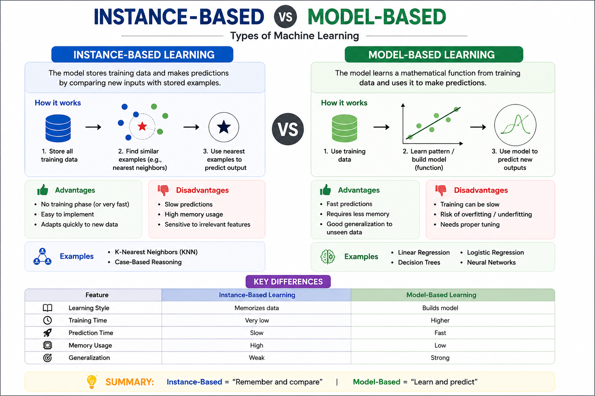

# Instance-Based vs Model-Based Learning (Types of Machine Learning)

## Machine Learning
Machine Learning is divided into different learning approaches. Two important types are Instance-Based Learning and Model-Based Learning.

---

## Instance-Based Learning

Instance-Based Learning is a method where the model **stores training data** and makes predictions by comparing new inputs with existing data.

### How it works:
- Stores all training examples
- Finds similarity between new input and stored data
- Uses nearest examples to predict output

### Examples:
- K-Nearest Neighbors (KNN)

### Advantages:
- No real training phase
- Easy to implement
- Adapts quickly to new data

### Disadvantages:
- Slow predictions
- High memory usage
- Poor scalability

---

## Model-Based Learning

Model-Based Learning builds a **mathematical model** from training data and uses it for predictions.

### How it works:
- Learns patterns from data
- Builds a function/model
- Uses model to predict new outputs

### Examples:
- Linear Regression
- Logistic Regression
- Decision Trees
- Neural Networks

### Advantages:
- Fast predictions
- Less memory usage
- Better generalization

### Disadvantages:
- Training can be slow
- May overfit or underfit
- Needs tuning

---

## Key Difference

| Feature | Instance-Based | Model-Based |
|--------|---------------|-------------|
| Learning | Memorizes data | Builds model |
| Training | Minimal | Required |
| Prediction | Slow | Fast |
| Memory | High | Low |

---

## Summary
Instance-Based Learning = remembers and compares data  
Model-Based Learning = learns patterns and predicts