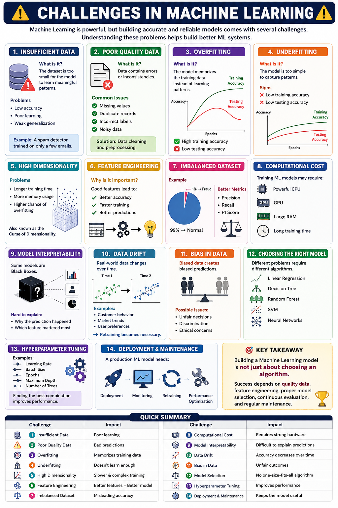

# ⚠️ Challenges in Machine Learning | Problems in Machine Learning

> Machine Learning is powerful, but building accurate and reliable models comes with several challenges. Understanding these problems helps build better ML systems.

---


# 📚 Table of Contents

* ## 1. Insufficient Data
* ## 2. Poor Quality Data
* ## 3. Overfitting
* ## 4. Underfitting
* ## 5. High Dimensionality
* ## 6. Feature Engineering
* ## 7. Imbalanced Dataset
* ## 8. Computational Cost
* ## 9. Model Interpretability
* ## 10. Data Drift
* ## 11. Bias in Data
* ## 12. Choosing the Right Model
* ## 13. Hyperparameter Tuning
* ## 14. Deployment & Maintenance
* ## Quick Summary

---

# 📉 1. Insufficient Data

### ❓ What is it?

The dataset is too small for the model to learn meaningful patterns.

### ⚠️ Problems

* Low accuracy
* Poor learning
* Weak generalization

### 💡 Example

A spam detector trained on only a few emails.

---

# 🗑️ 2. Poor Quality Data

### ❓ What is it?

Data contains errors or inconsistencies.

### ⚠️ Common Issues

* Missing values
* Duplicate records
* Incorrect labels
* Noisy data

### ✅ Solution

Data cleaning and preprocessing.

---

# 🎯 3. Overfitting

### ❓ What is it?

The model memorizes the training data instead of learning patterns.

### 📌 Signs

* ✅ High training accuracy
* ❌ Low testing accuracy

---

# 📚 4. Underfitting

### ❓ What is it?

The model is too simple to capture patterns.

### 📌 Signs

* ❌ Low training accuracy
* ❌ Low testing accuracy

---

# 📊 5. High Dimensionality

### ⚠️ Problems

* Longer training time
* More memory usage
* Higher chance of overfitting

> Also known as the **Curse of Dimensionality**.

---

# 🧩 6. Feature Engineering

### Why is it important?

Good features lead to:

* Better accuracy
* Faster training
* Better predictions

---

# ⚖️ 7. Imbalanced Dataset

### Example

```text
99% → Normal
 1% → Fraud
```

### Better Metrics

* Precision
* Recall
* F1 Score

---

# 💻 8. Computational Cost

Training ML models may require:

* Powerful CPU
* GPU
* Large RAM
* Long training time

---

# 🔍 9. Model Interpretability

Some models are **Black Boxes**.

Hard to explain:

* Why the prediction happened
* Which feature mattered most

---

# 🔄 10. Data Drift

Real-world data changes over time.

Examples:

* Customer behavior
* Market trends
* User preferences

➡️ Retraining becomes necessary.

---

# ⚠️ 11. Bias in Data

Biased data creates biased predictions.

Possible issues:

* Unfair decisions
* Discrimination
* Ethical concerns

---

# 🤖 12. Choosing the Right Model

Different problems require different algorithms.

Examples:

* Linear Regression
* Decision Tree
* Random Forest
* SVM
* Neural Networks

---

# ⚙️ 13. Hyperparameter Tuning

Examples:

* Learning Rate
* Batch Size
* Epochs
* Maximum Depth
* Number of Trees

Finding the best combination improves performance.

---

# 🚀 14. Deployment & Maintenance

A production ML model needs:

* Deployment
* Monitoring
* Retraining
* Performance optimization

---

# 📋 Quick Summary

| Challenge                | Impact                           |
| ------------------------ | -------------------------------- |
| Insufficient Data        | Poor learning                    |
| Poor Quality Data        | Bad predictions                  |
| Overfitting              | Memorizes training data          |
| Underfitting             | Doesn't learn enough             |
| High Dimensionality      | Slower & complex training        |
| Feature Engineering      | Better features = Better model   |
| Imbalanced Dataset       | Misleading accuracy              |
| Computational Cost       | Requires strong hardware         |
| Model Interpretability   | Difficult to explain predictions |
| Data Drift               | Accuracy decreases over time     |
| Bias in Data             | Unfair outcomes                  |
| Model Selection          | No one-size-fits-all algorithm   |
| Hyperparameter Tuning    | Improves performance             |
| Deployment & Maintenance | Keeps the model useful           |

---

# 🎯 Key Takeaway

> Building a Machine Learning model is **not just about choosing an algorithm**. Success depends on **quality data, feature engineering, proper model selection, continuous evaluation, and regular maintenance**.
