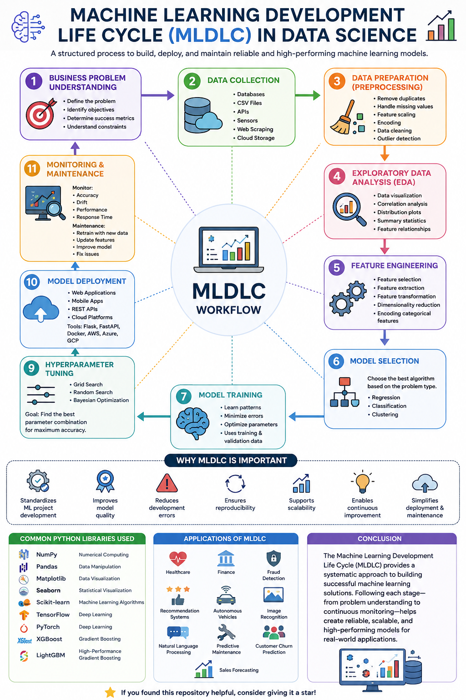

# 🤖 Machine Learning Development Life Cycle (MLDLC) in Data Science




The **Machine Learning Development Life Cycle (MLDLC)** is a structured process used to build, deploy, and maintain machine learning models. It ensures that models are accurate, scalable, reliable, and continuously improved over time.

---

# 📌 What is MLDLC?

MLDLC is the complete workflow followed when developing a machine learning project—from understanding the problem to deploying and monitoring the trained model in production.

The lifecycle helps data scientists and machine learning engineers build models efficiently while maintaining quality and reproducibility.

---

# 🔄 Stages of Machine Learning Development Life Cycle

## 1️⃣ Business Problem Understanding

The first step is to understand the business objective.

### Goals
- Define the problem
- Identify project objectives
- Determine success metrics
- Understand business constraints

**Example:**
Predict whether a customer will leave a telecom company.

---

## 2️⃣ Data Collection

Gather data from multiple sources.

### Data Sources
- Databases
- CSV Files
- APIs
- Sensors
- Web Scraping
- Cloud Storage

**Goal:** Collect sufficient, relevant, and high-quality data.

---

## 3️⃣ Data Preparation (Preprocessing)

Raw data usually contains missing values and inconsistencies.

### Common Tasks
- Remove duplicate records
- Handle missing values
- Feature scaling
- Encoding categorical variables
- Data cleaning
- Outlier detection

Well-prepared data leads to better model performance.

---

## 4️⃣ Exploratory Data Analysis (EDA)

EDA helps understand data patterns before training.

### Techniques
- Data visualization
- Correlation analysis
- Distribution plots
- Summary statistics
- Feature relationships

Popular libraries:
- Pandas
- Matplotlib
- Seaborn

---

## 5️⃣ Feature Engineering

Create better input features to improve model performance.

### Techniques
- Feature selection
- Feature extraction
- Feature transformation
- Dimensionality reduction
- Encoding categorical features

Good features often improve accuracy more than changing algorithms.

---

## 6️⃣ Model Selection

Choose the best algorithm based on the problem.

### Regression Algorithms
- Linear Regression
- Decision Tree Regressor
- Random Forest Regressor

### Classification Algorithms
- Logistic Regression
- Decision Tree
- Random Forest
- Support Vector Machine (SVM)
- K-Nearest Neighbors (KNN)
- Naive Bayes

### Clustering
- K-Means
- DBSCAN

---

## 7️⃣ Model Training

Train the selected algorithm using training data.

### Objectives
- Learn patterns
- Minimize prediction errors
- Optimize model parameters

Training typically uses:
- Training Dataset
- Validation Dataset

---

## 8️⃣ Model Evaluation

Evaluate model performance using unseen data.

### Common Metrics

### Classification
- Accuracy
- Precision
- Recall
- F1 Score
- ROC-AUC

### Regression
- MAE
- MSE
- RMSE
- R² Score

A good model should generalize well to new data.

---

## 9️⃣ Hyperparameter Tuning

Improve performance by optimizing model settings.

### Methods
- Grid Search
- Random Search
- Bayesian Optimization

Goal:
Find the best parameter combination for maximum accuracy.

---

## 🔟 Model Deployment

Deploy the trained model for real-world use.

### Deployment Options
- Web Applications
- Mobile Apps
- REST APIs
- Cloud Platforms

Popular deployment tools:
- Flask
- FastAPI
- Docker
- AWS
- Azure
- Google Cloud Platform

---

## 1️⃣1️⃣ Monitoring & Maintenance

Machine learning models require continuous monitoring.

### Monitor
- Accuracy
- Drift
- Performance
- Response Time

### Maintenance
- Retrain with new data
- Update features
- Improve model performance
- Fix issues

---

# 📊 Complete MLDLC Workflow

```
Business Understanding
          ↓
   Data Collection
          ↓
 Data Preprocessing
          ↓
 Exploratory Data Analysis
          ↓
 Feature Engineering
          ↓
   Model Selection
          ↓
   Model Training
          ↓
  Model Evaluation
          ↓
Hyperparameter Tuning
          ↓
   Model Deployment
          ↓
Monitoring & Maintenance
```

---

# 🎯 Why MLDLC is Important

- Standardizes ML project development
- Improves model quality
- Reduces development errors
- Ensures reproducibility
- Supports scalability
- Enables continuous improvement
- Simplifies deployment and maintenance

---

# 📚 Common Python Libraries Used

| Library | Purpose |
|----------|----------|
| NumPy | Numerical Computing |
| Pandas | Data Manipulation |
| Matplotlib | Data Visualization |
| Seaborn | Statistical Visualization |
| Scikit-learn | Machine Learning Algorithms |
| TensorFlow | Deep Learning |
| PyTorch | Deep Learning |
| XGBoost | Gradient Boosting |
| LightGBM | High-Performance Gradient Boosting |

---

# 🚀 Applications of MLDLC

- Healthcare
- Finance
- Fraud Detection
- Recommendation Systems
- Autonomous Vehicles
- Image Recognition
- Natural Language Processing
- Predictive Maintenance
- Customer Churn Prediction
- Sales Forecasting

---

# 📖 Conclusion

The **Machine Learning Development Life Cycle (MLDLC)** provides a systematic approach to building successful machine learning solutions. Following each stage—from problem understanding to continuous monitoring—helps create reliable, scalable, and high-performing models for real-world applications.

---

## ⭐ If you found this repository helpful, consider giving it a star!