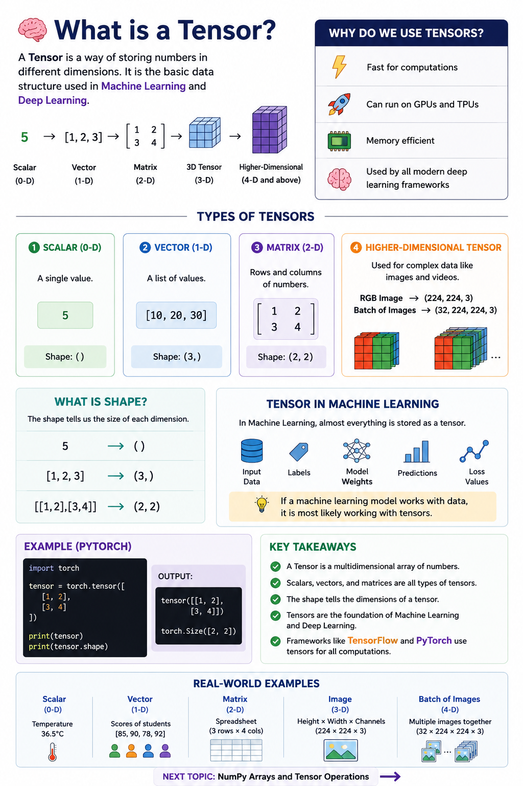

# 🧠 What is a Tensor?




## 📌 Introduction

A **Tensor** is the basic data structure used in **Machine Learning** and **Deep Learning**. It is simply a way of storing numbers in different dimensions.

You can think of a tensor as a generalized version of:

- A single number (Scalar)
- A list of numbers (Vector)
- A table of numbers (Matrix)
- Higher-dimensional data (Images, Videos, etc.)

Almost every machine learning framework like **TensorFlow** and **PyTorch** uses tensors to store and process data.

---

# 📊 Types of Tensors

### 1️⃣ Scalar (0-D Tensor)

A single value.

```python
5
```

Shape:

```text
()
```

---

### 2️⃣ Vector (1-D Tensor)

A list of values.

```python
[10, 20, 30]
```

Shape:

```text
(3,)
```

---

### 3️⃣ Matrix (2-D Tensor)

Rows and columns of numbers.

```python
[
 [1, 2],
 [3, 4]
]
```

Shape:

```text
(2, 2)
```

---

### 4️⃣ Higher-Dimensional Tensor

Used for complex data like images and videos.

Example:

```text
RGB Image → (224, 224, 3)

Batch of Images → (32, 224, 224, 3)
```

---

# 📐 What is Shape?

The **shape** tells us the size of each dimension.

Examples:

```text
5              → ()

[1,2,3]        → (3,)

[[1,2],[3,4]]  → (2,2)
```

---

# 🎯 Why Do We Use Tensors?

Tensors are:

- ⚡ Fast for computations
- 🚀 Can run on GPUs and TPUs
- 💾 Memory efficient
- 🧠 Used by all modern deep learning frameworks

---

# 🤖 Tensor in Machine Learning

In Machine Learning, almost everything is stored as a tensor:

- Input data
- Labels
- Model weights
- Predictions
- Loss values

In simple words:

> **If a machine learning model works with data, it is most likely working with tensors.**

---

# 💻 Example (PyTorch)

```python
import torch

tensor = torch.tensor([
    [1, 2],
    [3, 4]
])

print(tensor)
print(tensor.shape)
```

Output:

```text
tensor([[1, 2],
        [3, 4]])

torch.Size([2, 2])
```

---

# ✅ Key Takeaways

- A **Tensor** is a multidimensional array of numbers.
- Scalars, vectors, and matrices are all types of tensors.
- The **shape** tells the dimensions of a tensor.
- Tensors are the foundation of Machine Learning and Deep Learning.
- Frameworks like **TensorFlow** and **PyTorch** use tensors for all computations.

---

## 📚 Next Topic

➡️ NumPy Arrays and Tensor Operations