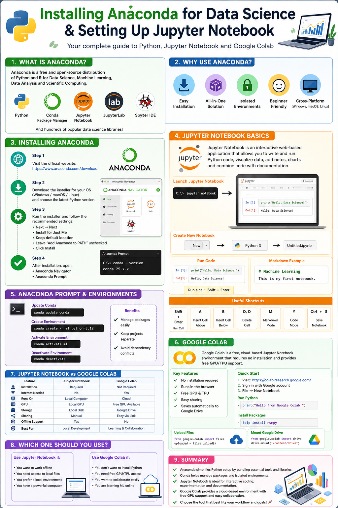

# 🐍 Installing Anaconda & Getting Started with Jupyter Notebook and Google Colab



## 📌 Introduction

Before learning **Data Science** and **Machine Learning**, you need a Python environment to write and run your code. Two of the most popular options are **Anaconda** (local setup) and **Google Colab** (cloud-based).

---

# 🚀 What is Anaconda?

**Anaconda** is a Python distribution designed for Data Science. It comes with:

- Python
- Conda Package Manager
- Jupyter Notebook
- Popular data science libraries

### Why Use Anaconda?

- ✅ Easy to install
- ✅ Beginner-friendly
- ✅ Manages packages with `conda`
- ✅ Supports virtual environments

---

# 📥 Installing Anaconda

1. Download Anaconda from the official website.
2. Run the installer and follow the default setup.
3. Open **Anaconda Navigator** or **Anaconda Prompt** after installation.

Check if Conda is installed:

```bash
conda --version
```

Launch Jupyter Notebook:

```bash
jupyter notebook
```

---

# 📓 What is Jupyter Notebook?

**Jupyter Notebook** is an interactive environment where you can:

- Write and run Python code
- Visualize data
- Add Markdown notes
- Experiment with Machine Learning models

Example:

```python
print("Hello, Data Science!")
```

Run a cell using:

- **Shift + Enter**

---

# ☁️ What is Google Colab?

**Google Colab** is a free, cloud-based version of Jupyter Notebook provided by Google.

### Features

- No installation required
- Runs in your browser
- Free GPU & TPU support
- Easy collaboration
- Auto-saves to Google Drive

Open Colab:

> https://colab.research.google.com/

Example:

```python
print("Hello from Google Colab!")
```

Install packages:

```python
!pip install numpy
```

---

# ⚖️ Jupyter Notebook vs Google Colab

| Feature | Jupyter Notebook | Google Colab |
|----------|------------------|--------------|
| Installation | Required | Not Required |
| Works Offline | ✅ Yes | ❌ No |
| Free GPU | ❌ No | ✅ Yes |
| Best For | Local Development | Learning & Collaboration |

---

# ✅ Summary

- **Anaconda** provides a complete Python environment for Data Science.
- **Jupyter Notebook** is ideal for coding, data analysis, and experimentation on your local machine.
- **Google Colab** lets you write and run Python code in the cloud without installation, making it perfect for learning and collaboration.
- Both are excellent tools for Machine Learning—choose the one that best fits your workflow. 