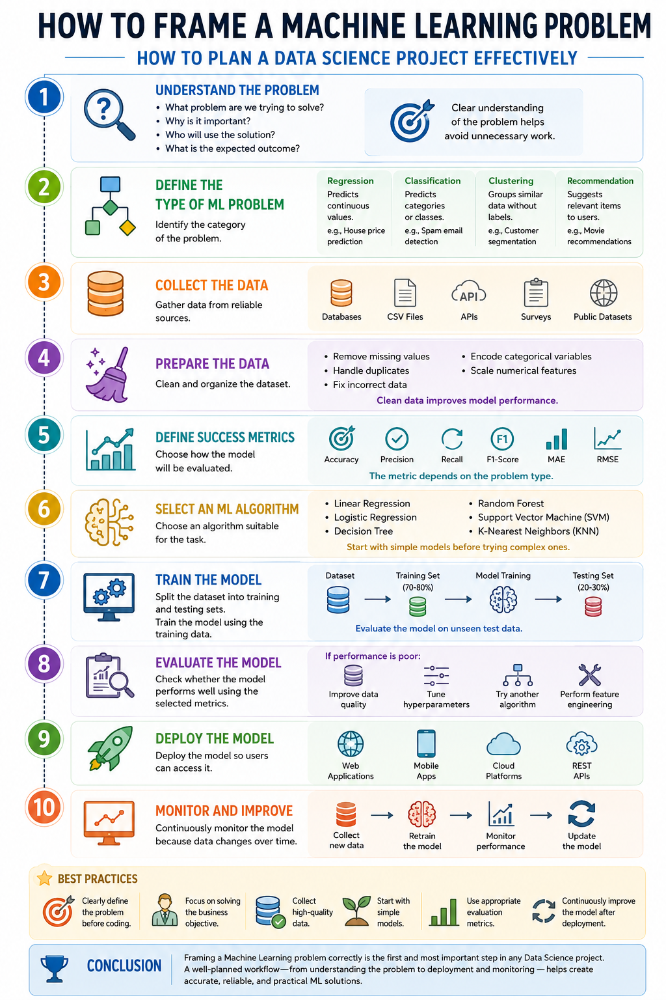

# 🧠 How to Frame a Machine Learning Problem | How to Plan a Data Science Project Effectively

## 📌 Introduction

A Machine Learning project should always begin with a clearly defined problem. Before selecting algorithms or writing code, it is important to understand the business objective, identify the available data, and define how success will be measured.

Proper problem framing increases the chances of building a useful and accurate ML solution.

---

# 🚀 Step 1: Understand the Problem

Start by answering questions like:

- What problem are we trying to solve?
- Why is it important?
- Who will use the solution?
- What is the expected outcome?

A clear understanding of the problem helps avoid unnecessary work.

---

# 📊 Step 2: Define the Type of Machine Learning Problem

Identify the category of the problem.

### Regression
Predicts continuous values.

**Examples:**
- House price prediction
- Temperature forecasting
- Sales prediction

---

### Classification
Predicts categories or classes.

**Examples:**
- Spam email detection
- Disease prediction
- Customer churn prediction

---

### Clustering
Groups similar data without labels.

**Examples:**
- Customer segmentation
- Document grouping
- Market analysis

---

### Recommendation
Suggests relevant items to users.

**Examples:**
- Movie recommendations
- Product recommendations
- Music suggestions

---

# 📂 Step 3: Collect the Data

Gather data from reliable sources such as:

- Databases
- CSV files
- APIs
- Surveys
- Public datasets

Good data is the foundation of every successful ML project.

---

# 🧹 Step 4: Prepare the Data

Clean and organize the dataset by:

- Removing missing values
- Handling duplicates
- Fixing incorrect data
- Encoding categorical variables
- Scaling numerical features

Clean data improves model performance.

---

# 📈 Step 5: Define Success Metrics

Choose how the model will be evaluated.

Examples:

- Accuracy
- Precision
- Recall
- F1-Score
- Mean Absolute Error (MAE)
- Root Mean Square Error (RMSE)

The metric depends on the problem type.

---

# 🤖 Step 6: Select an ML Algorithm

Choose an algorithm suitable for the task.

Examples:

- Linear Regression
- Logistic Regression
- Decision Tree
- Random Forest
- Support Vector Machine (SVM)
- K-Nearest Neighbors (KNN)

Start with simple models before trying complex ones.

---

# 🏋️ Step 7: Train the Model

Split the dataset into:

- Training Set
- Testing Set

Train the model using the training data and evaluate it on unseen test data.

---

# 📊 Step 8: Evaluate the Model

Check whether the model performs well using the selected evaluation metrics.

If performance is poor:

- Improve data quality
- Tune hyperparameters
- Try another algorithm
- Perform feature engineering

---

# 🚀 Step 9: Deploy the Model

After achieving satisfactory performance, deploy the model so users can access it.

Deployment options include:

- Web applications
- Mobile apps
- Cloud platforms
- REST APIs

---

# 🔄 Step 10: Monitor and Improve

Machine Learning models require continuous monitoring because data changes over time.

Regularly:

- Collect new data
- Retrain the model
- Monitor performance
- Update the deployed model

---

# 📌 Best Practices

- Clearly define the problem before coding.
- Focus on solving the business objective.
- Collect high-quality data.
- Start with simple models.
- Use appropriate evaluation metrics.
- Continuously improve the model after deployment.

---

# 🎯 Conclusion

Framing a Machine Learning problem correctly is the first and most important step in any Data Science project. A well-planned workflow—from understanding the problem to deployment and monitoring—helps create accurate, reliable, and practical ML solutions.