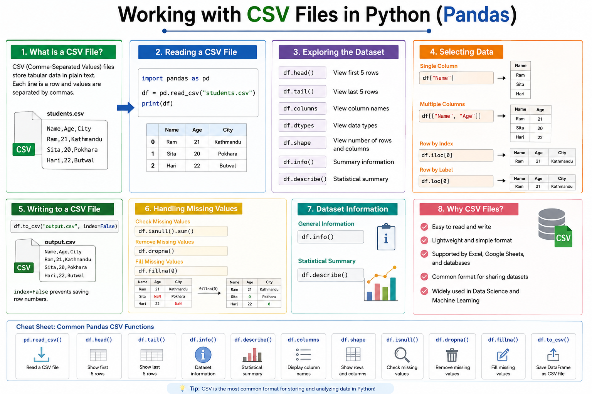

# Working with CSV Files



## 📌 Introduction

A **CSV (Comma-Separated Values)** file is one of the most commonly used file formats for storing tabular data. It is widely used in **Data Science**, **Machine Learning**, and **Data Analysis** because it is simple, lightweight, and supported by almost every spreadsheet and programming language.

---

# 📂 What is a CSV File?

A CSV file stores data in rows and columns.

Example:

```csv
Name,Age,City
Ram,21,Kathmandu
Sita,20,Pokhara
Hari,22,Butwal
```

- The first row usually contains column names (headers).
- Each new line represents a new record.
- Values are separated by commas.

---

# 📖 Reading a CSV File

```python
import pandas as pd

df = pd.read_csv("students.csv")

print(df)
```

Output:

```text
   Name  Age        City
0   Ram   21   Kathmandu
1  Sita   20     Pokhara
2  Hari   22     Butwal
```

---

# 📊 Exploring the Dataset

View the first 5 rows:

```python
df.head()
```

View the last 5 rows:

```python
df.tail()
```

View column names:

```python
df.columns
```

View data types:

```python
df.dtypes
```

View dataset shape:

```python
df.shape
```

---

# 🔍 Selecting Data

Single column:

```python
df["Name"]
```

Multiple columns:

```python
df[["Name", "Age"]]
```

Access a row by index:

```python
df.iloc[0]
```

Access a row by label:

```python
df.loc[0]
```

---

# ✏️ Writing to a CSV File

Save a DataFrame:

```python
df.to_csv("output.csv", index=False)
```

`index=False` prevents Pandas from saving row numbers.

---

# ⚠️ Handling Missing Values

Check missing values:

```python
df.isnull().sum()
```

Remove missing values:

```python
df.dropna()
```

Fill missing values:

```python
df.fillna(0)
```

---

# 📈 Dataset Information

General information:

```python
df.info()
```

Statistical summary:

```python
df.describe()
```

---

# 🚀 Why CSV Files are Important

- Easy to read and write.
- Lightweight file format.
- Supported by Excel, Google Sheets, and databases.
- Common format for sharing datasets.
- Widely used in Data Science and Machine Learning.

---

# 📚 Common Pandas Functions

| Function | Purpose |
|----------|---------|
| `pd.read_csv()` | Read a CSV file |
| `df.head()` | Show first 5 rows |
| `df.tail()` | Show last 5 rows |
| `df.info()` | Dataset information |
| `df.describe()` | Statistical summary |
| `df.columns` | Display column names |
| `df.shape` | Show rows and columns |
| `df.isnull()` | Check missing values |
| `df.dropna()` | Remove missing values |
| `df.fillna()` | Fill missing values |
| `df.to_csv()` | Save DataFrame as a CSV file |

---

# ✅ Summary

- CSV stands for **Comma-Separated Values**.
- Use `pd.read_csv()` to load CSV files.
- Explore data using `head()`, `tail()`, `info()`, and `describe()`.
- Select rows and columns using `loc`, `iloc`, and column names.
- Save data using `to_csv()`.
- CSV files are the most common format for storing and analyzing datasets in Python.