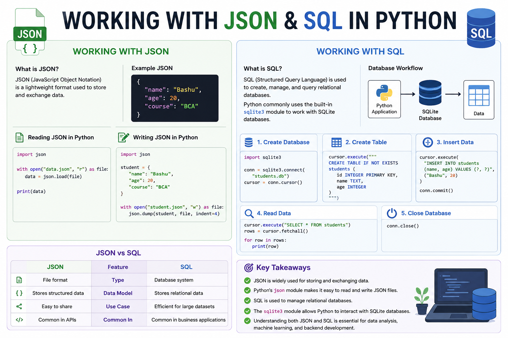

# 📘 Working with JSON & SQL



## 📌 Introduction

In data science and software development, data is often stored in different formats. Two of the most common are **JSON** and **SQL databases**. Learning how to read, write, and manipulate data from these sources is an essential skill.

---

# 🌐 Working with JSON

## What is JSON?

**JSON (JavaScript Object Notation)** is a lightweight format used to store and exchange data. It is easy for humans to read and easy for machines to process.

### Example JSON

```json
{
  "name": "Bashu",
  "age": 20,
  "course": "BCA"
}
```

---

## Reading JSON in Python

```python
import json

with open("data.json", "r") as file:
    data = json.load(file)

print(data)
```

---

## Writing JSON in Python

```python
import json

student = {
    "name": "Bashu",
    "age": 20,
    "course": "BCA"
}

with open("student.json", "w") as file:
    json.dump(student, file, indent=4)
```

---

# 🗄️ Working with SQL

## What is SQL?

**SQL (Structured Query Language)** is used to create, manage, and query relational databases.

Python commonly uses the built-in **sqlite3** module to work with SQLite databases.

---

## Creating a Database

```python
import sqlite3

conn = sqlite3.connect("students.db")
cursor = conn.cursor()
```

---

## Creating a Table

```python
cursor.execute("""
CREATE TABLE IF NOT EXISTS students (
    id INTEGER PRIMARY KEY,
    name TEXT,
    age INTEGER
)
""")
```

---

## Inserting Data

```python
cursor.execute(
    "INSERT INTO students (name, age) VALUES (?, ?)",
    ("Bashu", 20)
)

conn.commit()
```

---

## Reading Data

```python
cursor.execute("SELECT * FROM students")

rows = cursor.fetchall()

for row in rows:
    print(row)
```

---

## Closing the Database

```python
conn.close()
```

---

# 📊 JSON vs SQL

| JSON | SQL |
|------|------|
| File format | Database system |
| Stores structured data | Stores relational data |
| Easy to share | Efficient for large datasets |
| Common in APIs | Common in business applications |

---

# 🎯 Key Takeaways

- JSON is widely used for storing and exchanging data.
- Python's `json` module makes it easy to read and write JSON files.
- SQL is used to manage relational databases.
- The `sqlite3` module allows Python to interact with SQLite databases.
- Understanding both JSON and SQL is essential for data analysis, machine learning, and backend development.