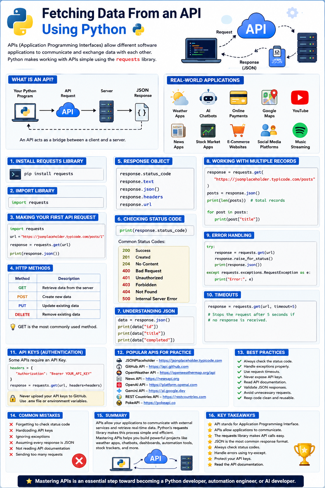

# 🌐 Fetching Data From an API Using Python



## 📌 Introduction

APIs (**Application Programming Interfaces**) allow different software applications to communicate and exchange data with one another. Instead of accessing a database directly, your application sends a request to an API, and the server responds with the required information.

Today, APIs power almost every modern application—from weather apps and online banking to AI chatbots and social media platforms.

Python provides an easy way to interact with APIs using the **requests** library.

---

## 🤔 What is an API?

An API acts as a **bridge** between a client and a server.

```
Your Python Program
        │
        ▼
     API Request
        │
        ▼
       Server
        │
        ▼
   JSON Response
        │
        ▼
Your Python Program
```

The server processes the request and sends back data, usually in **JSON** format.

---

## 🌍 Real-World Applications of APIs

APIs are used in almost every modern software application.

Some common examples include:

- 🌦️ Weather Applications
- 🤖 AI Chatbots
- 💳 Online Payment Systems
- 🗺️ Google Maps
- 🎵 Spotify
- 📺 YouTube
- 📰 News Applications
- 📈 Stock Market Apps
- 🛒 E-Commerce Websites
- 📱 Social Media Platforms

---

## 🚀 Installing the Requests Library

Install the Requests library using pip.

```bash
pip install requests
```

Import the library into your project.

```python
import requests
```

---

## 📥 Making Your First API Request

```python
import requests

url = "https://jsonplaceholder.typicode.com/posts/1"

response = requests.get(url)

print(response.json())
```

The `get()` method sends an HTTP GET request to the API and returns a **Response** object.

---

## 📖 Understanding HTTP Methods

| Method | Description |
|---------|-------------|
| GET | Retrieve data from the server |
| POST | Create new data |
| PUT | Update existing data |
| DELETE | Remove existing data |

The **GET** method is the most commonly used because it retrieves information without modifying the server.

---

## 📌 Understanding the Response Object

When an API responds, Python stores everything inside a **Response Object**.

Useful attributes include:

```python
response.status_code

response.text

response.json()

response.headers

response.url
```

These attributes help you inspect the response received from the server.

---

## 📊 Checking the Status Code

```python
print(response.status_code)
```

Common HTTP Status Codes:

- ✅ 200 – Success
- ✅ 201 – Created
- ✅ 204 – No Content
- ❌ 400 – Bad Request
- ❌ 401 – Unauthorized
- ❌ 403 – Forbidden
- ❌ 404 – Not Found
- ❌ 500 – Internal Server Error

A status code of **200** usually means the request was successful.

---

## 📦 Understanding JSON

Most APIs return data in **JSON (JavaScript Object Notation)**.

Example:

```json
{
    "id": 1,
    "title": "Hello World",
    "completed": false
}
```

Python automatically converts JSON into a dictionary using:

```python
data = response.json()
```

---

## 📖 Accessing JSON Data

```python
data = response.json()

print(data["id"])
print(data["title"])
print(data["completed"])
```

You can access values using their keys just like a normal Python dictionary.

---

## 🔍 Working with Multiple Records

Some APIs return a list instead of a single object.

```python
response = requests.get(
    "https://jsonplaceholder.typicode.com/posts"
)

posts = response.json()

print(len(posts))
```

Loop through the data.

```python
for post in posts:
    print(post["title"])
```

---

## ⚠️ Error Handling

Always handle exceptions while working with APIs.

```python
try:

    response = requests.get(url)

    response.raise_for_status()

    print(response.json())

except requests.exceptions.RequestException as e:

    print("Error:", e)
```

This prevents your program from crashing if something goes wrong.

---

## ⏱️ Using Timeouts

Never allow your program to wait forever for a server response.

```python
response = requests.get(url, timeout=5)
```

The request will stop after **5 seconds** if no response is received.

---

## 🔑 API Keys

Many APIs require authentication using an API Key.

Example:

```python
headers = {
    "Authorization": "Bearer YOUR_API_KEY"
}
```

**Never upload your API keys to GitHub.**

Instead, store them inside a `.env` file or environment variables.

---

## 🌍 Popular APIs for Practice

- JSONPlaceholder
- GitHub API
- OpenWeather API
- News API
- OpenAI API
- Gemini API
- REST Countries API
- PokeAPI

These APIs are excellent for beginners learning API development.

---

## ✅ Best Practices

- Always check the status code.
- Handle exceptions properly.
- Use request timeouts.
- Never expose API keys.
- Read the official API documentation.
- Validate JSON responses.
- Avoid making unnecessary requests.
- Keep your code clean and reusable.

---

## 💡 Common Mistakes

❌ Forgetting to check the status code

❌ Hardcoding API keys

❌ Ignoring exceptions

❌ Assuming every response is JSON

❌ Not reading the API documentation

❌ Sending too many requests in a short time

---

## 🎯 Summary

Fetching data from an API is one of the most valuable skills for Python developers. APIs allow your applications to communicate with external services and retrieve real-time information.

By learning the **requests** library, HTTP methods, JSON parsing, status codes, and error handling, you can build weather apps, AI assistants, dashboards, automation tools, stock trackers, and many other real-world projects.

---

## ⭐ Key Takeaways

- API stands for **Application Programming Interface**.
- APIs allow applications to communicate.
- The `requests` library makes API calls simple.
- JSON is the most common response format.
- Always check status codes.
- Handle errors using `try-except`.
- Protect your API keys.
- Read the API documentation before using any API.

---

⭐ **Mastering APIs is an essential step toward becoming a Python developer, automation engineer, or AI developer.**