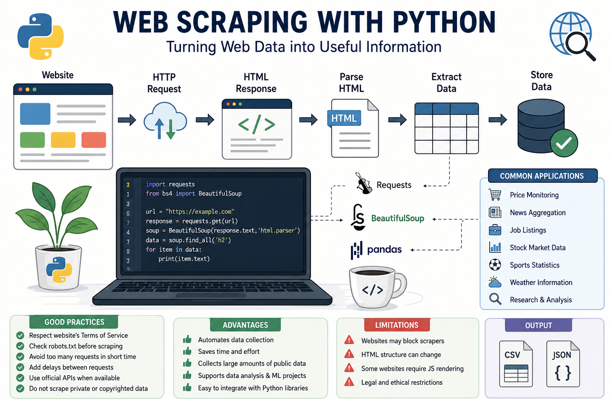

# 🌐 Fetching Data Using Web Scraping with Python




## 📌 Introduction

Web scraping is the process of automatically extracting data from websites using Python. It is useful when data is publicly available on web pages but cannot be easily downloaded as a file or accessed through an API.

Python provides powerful libraries that make web scraping simple and efficient.

---

# 🚀 What is Web Scraping?

**Web Scraping** is the technique of collecting information from web pages by sending an HTTP request, downloading the HTML content, and extracting the required data.

Typical workflow:

```
Website
    ↓
HTTP Request
    ↓
HTML Response
    ↓
Parse HTML
    ↓
Extract Data
    ↓
Store (CSV / JSON / Database)
```

---

# 📚 Popular Python Libraries

### 1. Requests

Used to send HTTP requests and download webpage content.

```python
import requests

url = "https://example.com"
response = requests.get(url)

print(response.status_code)
print(response.text)
```

---

### 2. BeautifulSoup

Used to parse HTML and extract specific elements.

```python
from bs4 import BeautifulSoup
import requests

url = "https://example.com"
response = requests.get(url)

soup = BeautifulSoup(response.text, "html.parser")

print(soup.title.text)
```

---

### 3. Pandas

Stores scraped data into tables and exports it.

```python
import pandas as pd

data = {
    "Name": ["Laptop", "Phone"],
    "Price": [1200, 800]
}

df = pd.DataFrame(data)

df.to_csv("products.csv", index=False)
```

---

# 📌 Basic Web Scraping Steps

### Step 1

Import the required libraries.

```python
import requests
from bs4 import BeautifulSoup
```

### Step 2

Send a request to the website.

```python
response = requests.get("https://example.com")
```

### Step 3

Parse the HTML.

```python
soup = BeautifulSoup(response.text, "html.parser")
```

### Step 4

Find the required elements.

```python
headings = soup.find_all("h2")

for heading in headings:
    print(heading.text)
```

### Step 5

Save the extracted data.

```python
import pandas as pd

df = pd.DataFrame({"Heading": [h.text for h in headings]})
df.to_csv("headings.csv", index=False)
```

---

# 🎯 Example: Scraping Quotes

```python
import requests
from bs4 import BeautifulSoup

url = "https://quotes.toscrape.com"

response = requests.get(url)

soup = BeautifulSoup(response.text, "html.parser")

quotes = soup.find_all("span", class_="text")

for quote in quotes:
    print(quote.text)
```

---

# ⚠️ Good Practices

- Respect the website's Terms of Service.
- Check the `robots.txt` file before scraping.
- Avoid sending too many requests in a short time.
- Add delays between requests when scraping multiple pages.
- Prefer official APIs whenever available.
- Do not scrape private or copyrighted data without permission.

---

# 🌍 Common Applications

- Price monitoring
- News aggregation
- Job listings collection
- Stock market data
- Sports statistics
- Weather information
- Research and data analysis

---

# 📈 Advantages

- Automates data collection.
- Saves time and effort.
- Collects large amounts of public data.
- Supports data analysis and machine learning projects.
- Easy to integrate with Python libraries.

---

# ⚠️ Limitations

- Websites may block scrapers.
- HTML structure can change over time.
- Some websites require JavaScript rendering.
- Legal and ethical restrictions may apply.

---

# 📝 Summary

Web scraping allows Python programs to automatically collect publicly available information from websites. Using libraries like **Requests**, **BeautifulSoup**, and **Pandas**, developers can download web pages, extract useful information, and save it for further analysis. It is an essential skill for data science, automation, and real-world data collection projects.