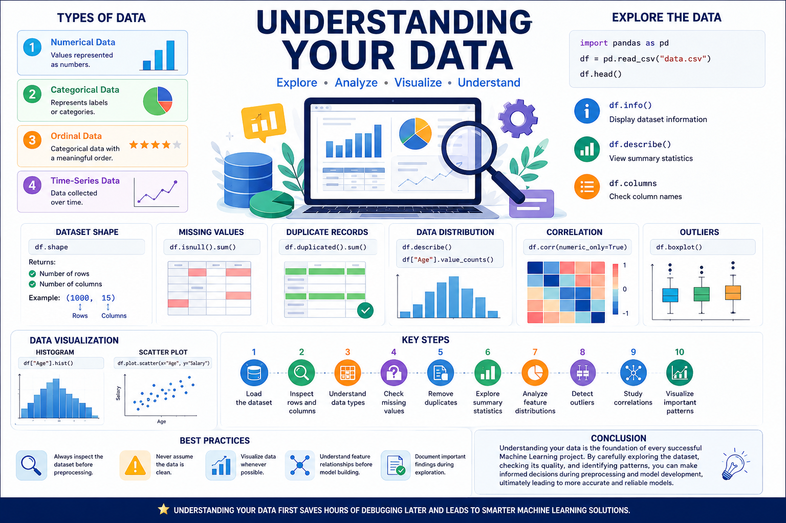

# 📊 Understanding Your Data



## 📌 Introduction

Before building any Machine Learning model, it is important to understand the dataset. A good understanding of your data helps identify patterns, detect errors, choose the right preprocessing techniques, and build better-performing models.

Data understanding is one of the most critical steps in the Data Science workflow.

---

# 🎯 Why Understanding Data Matters

- Helps identify missing or incorrect values.
- Reveals patterns and relationships.
- Detects outliers and anomalies.
- Prevents poor model performance.
- Guides feature selection and preprocessing.

---

# 📂 Types of Data

### 1. Numerical Data
Values represented as numbers.

**Examples:**
- Age
- Salary
- Height
- Temperature

### 2. Categorical Data
Represents labels or categories.

**Examples:**
- Gender
- Country
- Product Category
- Color

### 3. Ordinal Data
Categorical data with a meaningful order.

**Examples:**
- Small, Medium, Large
- Education Level
- Customer Ratings

### 4. Time-Series Data
Data collected over time.

**Examples:**
- Stock Prices
- Weather Data
- Sales Records

---

# 🔍 Explore the Dataset

The first step is to inspect the dataset.

```python
import pandas as pd

df = pd.read_csv("data.csv")

df.head()
```

Display dataset information:

```python
df.info()
```

View summary statistics:

```python
df.describe()
```

---

# 📏 Understanding Dataset Shape

```python
df.shape
```

Returns:

- Number of rows
- Number of columns

Example:

```
(1000, 15)
```

Meaning:
- 1000 rows
- 15 features

---

# 📝 Check Column Names

```python
df.columns
```

Useful for understanding available features.

---

# ❓ Check Missing Values

```python
df.isnull().sum()
```

This helps identify incomplete data that needs cleaning.

---

# 🔄 Check Duplicate Records

```python
df.duplicated().sum()
```

Duplicate records should often be removed before training.

---

# 📈 Understand Data Distribution

Useful methods:

```python
df.describe()
```

```python
df["Age"].value_counts()
```

These reveal how values are distributed.

---

# 📊 Correlation Between Features

```python
df.corr(numeric_only=True)
```

Correlation helps determine how strongly numerical variables are related.

- +1 → Strong positive relationship
- 0 → No relationship
- -1 → Strong negative relationship

---

# 📉 Detect Outliers

Outliers are unusual observations that differ significantly from the rest of the data.

Common visualization:

```python
import matplotlib.pyplot as plt

df.boxplot()
plt.show()
```

---

# 📌 Basic Data Visualization

Histogram:

```python
df["Age"].hist()
```

Scatter Plot:

```python
df.plot.scatter(x="Age", y="Salary")
```

Visualization helps uncover trends that may not be obvious from raw numbers.

---

# 🚀 Key Steps in Understanding Data

1. Load the dataset
2. Inspect rows and columns
3. Understand data types
4. Check missing values
5. Remove duplicates
6. Explore summary statistics
7. Analyze feature distributions
8. Detect outliers
9. Study correlations
10. Visualize important patterns

---

# 🎯 Best Practices

- Always inspect the dataset before preprocessing.
- Never assume the data is clean.
- Visualize data whenever possible.
- Understand feature relationships before model building.
- Document important findings during exploration.

---

# 🏁 Conclusion

Understanding your data is the foundation of every successful Machine Learning project. By carefully exploring the dataset, checking its quality, and identifying patterns, you can make informed decisions during preprocessing and model development, ultimately leading to more accurate and reliable models.

---

⭐ **Understanding your data first saves hours of debugging later and leads to smarter Machine Learning solutions.**