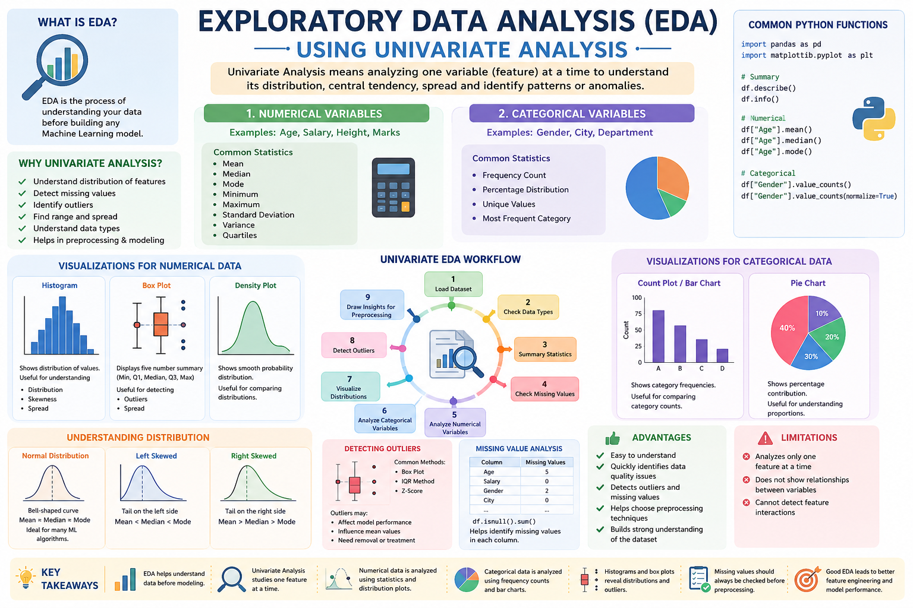

# 📊 Exploratory Data Analysis (EDA) Using Univariate Analysis



## 📌 Introduction

**Exploratory Data Analysis (EDA)** is the process of examining a dataset to understand its structure, patterns, and quality before building Machine Learning models.

**Univariate Analysis** is the simplest form of EDA where we analyze **one variable (feature) at a time**. It helps us understand the distribution, central tendency, spread, and presence of outliers in a dataset.

---

# 🎯 Why Univariate Analysis?

- Understand the distribution of individual features.
- Detect missing values.
- Identify outliers.
- Find the range of values.
- Understand data types.
- Prepare data for preprocessing and modeling.

---

# 📂 Types of Variables

## 1. Numerical Variables

These contain numeric values.

Examples:
- Age
- Salary
- Height
- Marks

### Common Statistics

- Mean
- Median
- Mode
- Minimum
- Maximum
- Standard Deviation
- Variance
- Quartiles

---

## 2. Categorical Variables

These contain labels or categories.

Examples:
- Gender
- City
- Department
- Education Level

### Common Statistics

- Frequency Count
- Percentage Distribution
- Unique Values
- Most Frequent Category

---

# 🛠 Common Python Functions

```python
import pandas as pd

df.describe()
df.info()

df["Age"].mean()
df["Age"].median()
df["Age"].mode()

df["Gender"].value_counts()
df["Gender"].value_counts(normalize=True)
```

---

# 📈 Visualizations for Numerical Data

## Histogram

Shows the distribution of values.

```python
import matplotlib.pyplot as plt

plt.hist(df["Age"], bins=20)
plt.show()
```

Useful for:
- Distribution
- Skewness
- Spread

---

## Box Plot

Displays:

- Minimum
- Q1
- Median
- Q3
- Maximum
- Outliers

```python
plt.boxplot(df["Age"])
plt.show()
```

Useful for:
- Detecting Outliers
- Understanding Spread

---

## Density Plot

Shows a smooth probability distribution.

```python
df["Age"].plot(kind="density")
```

Useful for:
- Understanding data distribution
- Comparing distributions

---

# 📊 Visualizations for Categorical Data

## Count Plot / Bar Chart

Shows category frequencies.

```python
df["Gender"].value_counts().plot(kind="bar")
```

Useful for:
- Comparing category counts
- Finding dominant classes

---

## Pie Chart

Shows percentage contribution.

```python
df["Gender"].value_counts().plot(kind="pie", autopct="%1.1f%%")
```

Useful for:
- Understanding proportions

---

# 📉 Understanding Distribution

### Normal Distribution

- Bell-shaped curve
- Mean ≈ Median ≈ Mode

Ideal for many Machine Learning algorithms.

---

### Left Skewed

- Tail extends to the left.
- Mean < Median.

---

### Right Skewed

- Tail extends to the right.
- Mean > Median.

---

# 🚨 Detecting Outliers

Outliers are unusually large or small values.

Common methods:

- Box Plot
- IQR Method
- Z-Score

Outliers may:
- Affect model performance
- Influence mean values
- Need removal or treatment

---

# 🔍 Missing Value Analysis

```python
df.isnull().sum()
```

This helps identify missing values in each column before preprocessing.

---

# 📌 Typical Univariate EDA Workflow

1. Load the dataset.
2. Check data types.
3. View summary statistics.
4. Detect missing values.
5. Analyze numerical variables.
6. Analyze categorical variables.
7. Plot distributions.
8. Detect outliers.
9. Draw insights for preprocessing.

---

# ✅ Advantages

- Easy to understand.
- Quickly identifies data quality issues.
- Detects outliers and missing values.
- Helps choose preprocessing techniques.
- Builds a strong understanding of the dataset.

---

# ⚠ Limitations

- Analyzes only one feature at a time.
- Does not show relationships between variables.
- Cannot detect feature interactions.

---

# 📚 Summary

Univariate Analysis is the first step in Exploratory Data Analysis (EDA). It focuses on examining a single variable to understand its distribution, central tendency, variability, and data quality. By using summary statistics and visualizations such as histograms, box plots, and bar charts, we can identify missing values, outliers, and important patterns, leading to better preprocessing and improved Machine Learning models.

---

## 🏁 Key Takeaways

- EDA helps understand data before modeling.
- Univariate Analysis studies one feature at a time.
- Numerical data is analyzed using statistics and distribution plots.
- Categorical data is analyzed using frequency counts and bar charts.
- Histograms and box plots reveal distributions and outliers.
- Missing values should always be checked before preprocessing.
- Good EDA leads to better feature engineering and model performance.