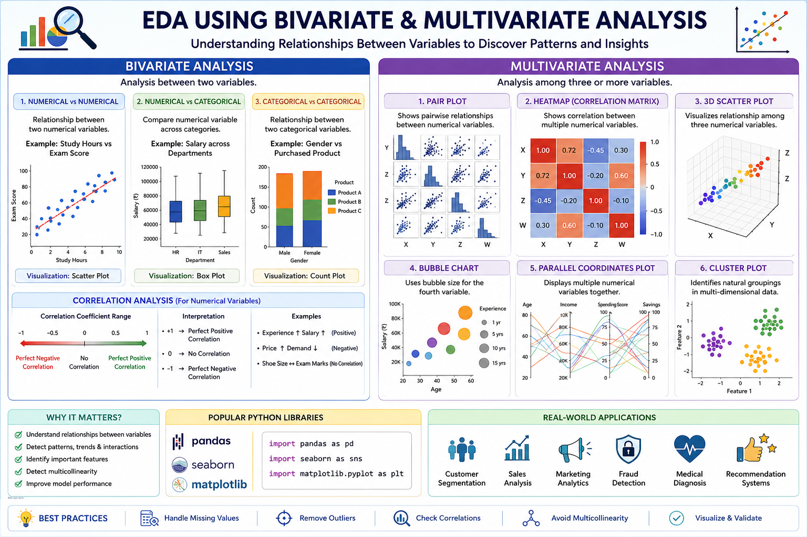

# 📊 EDA Using Bivariate and Multivariate Analysis



## 📌 Introduction

After performing **Univariate Analysis**, the next step in **Exploratory Data Analysis (EDA)** is to understand the relationships between variables. This is achieved through **Bivariate Analysis** and **Multivariate Analysis**.

These techniques help identify correlations, dependencies, patterns, trends, and interactions between multiple features, making them essential before building Machine Learning models.

---

# 🎯 Why Bivariate & Multivariate Analysis Matter

- Understand relationships between variables.
- Detect strong and weak correlations.
- Discover hidden patterns in data.
- Identify important features for prediction.
- Detect multicollinearity between variables.
- Improve feature engineering.
- Support better model selection and performance.

---

# 📈 Bivariate Analysis

## What is Bivariate Analysis?

**Bivariate Analysis** studies the relationship between **two variables**.

One variable is analyzed against another to determine whether they are related and how strongly they influence each other.

### Example

- Age vs Salary
- Hours Studied vs Exam Score
- Temperature vs Ice Cream Sales
- Experience vs Income

---

# Types of Bivariate Analysis

## 1. Numerical vs Numerical

Used to understand relationships between two numerical variables.

### Common Visualizations

- Scatter Plot
- Line Plot
- Correlation Heatmap

### Example

```
Study Hours → Exam Score
```

More study hours generally lead to higher exam scores.

---

## 2. Numerical vs Categorical

Used to compare a numerical feature across different categories.

### Common Visualizations

- Box Plot
- Violin Plot
- Bar Plot

### Example

```
Salary across Departments
```

This helps compare salary distributions among departments.

---

## 3. Categorical vs Categorical

Used to examine relationships between two categorical variables.

### Common Visualizations

- Count Plot
- Stacked Bar Chart
- Crosstab
- Heatmap

### Example

```
Gender vs Purchased Product
```

Shows whether purchasing behavior differs by gender.

---

# Correlation Analysis

Correlation measures the strength of the relationship between numerical variables.

### Correlation Coefficient Range

| Value | Relationship |
|--------|--------------|
| +1 | Perfect Positive Correlation |
| 0 | No Correlation |
| -1 | Perfect Negative Correlation |

---

## Positive Correlation

As one variable increases, the other also increases.

Example:

```
Experience ↑
Salary ↑
```

---

## Negative Correlation

As one variable increases, the other decreases.

Example:

```
Price ↑
Demand ↓
```

---

## No Correlation

The variables do not influence each other.

Example:

```
Shoe Size
Exam Marks
```

---

# 📊 Multivariate Analysis

## What is Multivariate Analysis?

**Multivariate Analysis** examines the relationship between **three or more variables simultaneously**.

Instead of studying variables individually, it explores how multiple features interact together.

---

# Why Multivariate Analysis?

It helps to:

- Discover complex relationships.
- Detect interactions between variables.
- Improve feature selection.
- Reduce dimensionality.
- Build better predictive models.

---

# Common Multivariate Visualizations

## Pair Plot

Compares every numerical feature with every other feature.

Useful for:

- Pattern detection
- Correlation
- Outlier detection

---

## Heatmap

Displays the correlation matrix using colors.

- Dark color → Strong relationship
- Light color → Weak relationship

---

## 3D Scatter Plot

Shows relationships among three numerical variables simultaneously.

Example:

```
Age
Income
Spending Score
```

---

## Bubble Chart

Adds a fourth variable using bubble size.

Example:

```
X-axis → Age
Y-axis → Salary
Bubble Size → Experience
```

---

## Parallel Coordinates Plot

Displays multiple numerical features together.

Useful for:

- Comparing observations
- Detecting clusters

---

# Popular Python Libraries

```python
import pandas as pd
import matplotlib.pyplot as plt
import seaborn as sns
```

---

# Common Functions

### Scatter Plot

```python
sns.scatterplot(data=df, x="Age", y="Salary")
```

### Box Plot

```python
sns.boxplot(data=df, x="Department", y="Salary")
```

### Pair Plot

```python
sns.pairplot(df)
```

### Correlation Matrix

```python
df.corr(numeric_only=True)
```

### Heatmap

```python
sns.heatmap(df.corr(numeric_only=True), annot=True, cmap="coolwarm")
```

---

# Real-World Applications

- Customer Segmentation
- Sales Analysis
- Medical Diagnosis
- Financial Risk Prediction
- Marketing Analytics
- Fraud Detection
- Stock Market Analysis
- Recommendation Systems

---

# Best Practices

- Perform Univariate Analysis first.
- Handle missing values before analysis.
- Remove duplicate records.
- Detect and treat outliers.
- Normalize data if required.
- Check feature correlations.
- Avoid multicollinearity.
- Use visualizations to validate findings.

---

# Advantages

- Better understanding of data relationships.
- Identifies meaningful patterns.
- Helps select important features.
- Improves Machine Learning model performance.
- Detects hidden trends and anomalies.
- Supports informed decision-making.

---

# Limitations

- Large datasets may produce complex visualizations.
- Correlation does not imply causation.
- Sensitive to outliers.
- High-dimensional data can be difficult to interpret.
- Requires proper preprocessing for accurate insights.

---

# 📚 Summary

**Bivariate Analysis** focuses on understanding the relationship between **two variables**, while **Multivariate Analysis** explores interactions among **three or more variables**. Together, they provide valuable insights into patterns, correlations, and feature interactions, helping data scientists make informed decisions and build more accurate Machine Learning models.