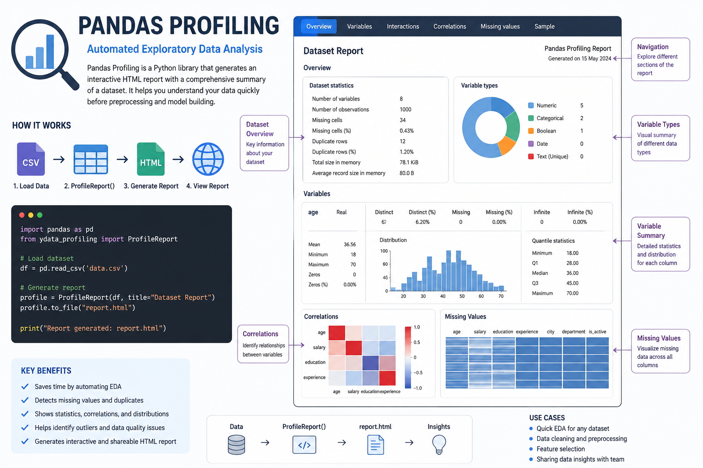

# Pandas Profiling (Automated Exploratory Data Analysis)



## Introduction

**Pandas Profiling** (now available through the **ydata-profiling** package) is an automated Exploratory Data Analysis (EDA) tool that generates a comprehensive report for a dataset with just a few lines of code. It summarizes the dataset, detects data quality issues, and provides visual insights, making the initial data exploration process much faster.

---

## Why Use Pandas Profiling?

- Automates the EDA process.
- Generates a detailed report with minimal code.
- Detects missing values and duplicate records.
- Displays descriptive statistics for each feature.
- Identifies correlations between variables.
- Helps understand the dataset before preprocessing and model building.

---

## Installation

```bash
pip install ydata-profiling
```

---

## Import Libraries

```python
import pandas as pd
from ydata_profiling import ProfileReport
```

---

## Load a Dataset

```python
df = pd.read_csv("data.csv")
```

---

## Generate the Report

```python
profile = ProfileReport(df, title="Dataset Report", explorative=True)

profile.to_file("report.html")
```

This generates an interactive HTML report named **report.html**.

---

## Information Included in the Report

The generated report typically includes:

- Dataset overview
- Number of rows and columns
- Data types
- Missing value analysis
- Duplicate records
- Descriptive statistics
- Correlation analysis
- Distribution plots
- Outlier detection
- Sample data preview

---

## Example

```python
import pandas as pd
from ydata_profiling import ProfileReport

df = pd.read_csv("students.csv")

profile = ProfileReport(df, title="Students Dataset Report")
profile.to_file("students_report.html")
```

Open **students_report.html** in your browser to explore the dataset.

---

## Advantages

- Requires very little code.
- Produces detailed and interactive reports.
- Speeds up the EDA process.
- Helps identify data quality issues early.
- Useful for feature selection and preprocessing.

---

## Limitations

- Can be slow for very large datasets.
- Requires more memory than manual EDA.
- Reports may become large for datasets with many features.

---

## Best Practices

- Perform basic cleaning before generating the report.
- Use profiling during the initial exploration stage.
- Review correlations before feature engineering.
- Combine automated profiling with manual EDA for deeper analysis.

---

## Summary

Pandas Profiling is a powerful tool for automating Exploratory Data Analysis. It provides a detailed overview of a dataset, helping identify missing values, correlations, distributions, and other important characteristics. It is an excellent starting point for any data analysis or machine learning project.