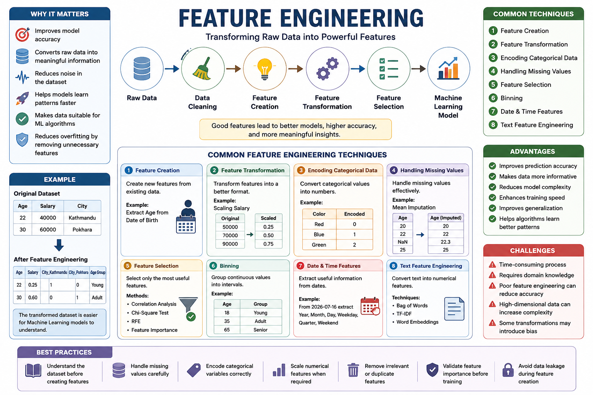

# 🛠️ Feature Engineering



## 📌 Introduction

Feature Engineering is the process of creating, modifying, and selecting features (input variables) from raw data to improve the performance of Machine Learning models. Well-engineered features help models learn patterns more effectively, resulting in higher accuracy and better predictions.

It is one of the most important steps in the Machine Learning pipeline because the quality of features often has a greater impact on model performance than the choice of algorithm.

---

# 🎯 Why Feature Engineering Matters

- Improves model accuracy.
- Converts raw data into meaningful information.
- Reduces noise in the dataset.
- Helps models learn patterns faster.
- Makes data suitable for Machine Learning algorithms.
- Can reduce overfitting by removing unnecessary features.

---

# 🔄 Feature Engineering Workflow

```
Raw Data
    │
    ▼
Data Cleaning
    │
    ▼
Feature Creation
    │
    ▼
Feature Transformation
    │
    ▼
Feature Selection
    │
    ▼
Machine Learning Model
```

---

# 🧩 Common Feature Engineering Techniques

## 1. Feature Creation

Creating new features from existing data.

### Examples

- Extracting **Age** from Date of Birth.
- Extracting **Year**, **Month**, or **Day** from a Date column.
- Calculating **BMI** using height and weight.
- Combining first name and last name into a full name.

---

## 2. Feature Transformation

Changing existing features into a better format.

Examples include:

- Scaling numerical values
- Normalization
- Standardization
- Log transformation

Example:

Original Salary

```
50000
70000
90000
```

After Scaling

```
0.25
0.50
0.75
```

---

## 3. Encoding Categorical Data

Machine Learning models work with numbers, so categorical values must be converted.

Example

| Color | Encoded |
|--------|---------|
| Red | 0 |
| Blue | 1 |
| Green | 2 |

Common methods:

- Label Encoding
- One-Hot Encoding
- Target Encoding

---

## 4. Handling Missing Values

Missing values can reduce model performance.

Common approaches:

- Fill with Mean
- Fill with Median
- Fill with Mode
- Predict missing values
- Remove rows or columns

Example

| Age |
|-----|
| 20 |
| 22 |
| NaN |
| 25 |

After Mean Imputation

| Age |
|-----|
| 20 |
| 22 |
| 22.3 |
| 25 |

---

## 5. Feature Selection

Choosing only the most useful features.

Benefits:

- Faster training
- Better accuracy
- Less overfitting
- Simpler models

Methods include:

- Correlation Analysis
- Chi-Square Test
- Recursive Feature Elimination (RFE)
- Feature Importance

---

## 6. Binning

Grouping continuous values into intervals.

Example

| Age | Group |
|-----|-------|
| 18 | Young |
| 35 | Adult |
| 65 | Senior |

---

## 7. Date & Time Features

Useful information can be extracted from dates.

Example

Date:

```
2026-07-16
```

Extract:

- Year
- Month
- Day
- Weekday
- Quarter
- Weekend

---

## 8. Text Feature Engineering

Convert text into numerical features.

Techniques:

- Bag of Words
- TF-IDF
- Word Embeddings

Applications:

- Spam Detection
- Sentiment Analysis
- Chatbots

---

# 📊 Example

Original Dataset

| Age | Salary | City |
|------|--------|------|
| 22 | 40000 | Kathmandu |
| 30 | 60000 | Pokhara |

After Feature Engineering

| Age | Salary | City_Kathmandu | City_Pokhara | Age Group |
|------|--------|----------------|--------------|-----------|
| 22 | 0.25 | 1 | 0 | Young |
| 30 | 0.60 | 0 | 1 | Adult |

The transformed dataset is easier for Machine Learning models to understand.

---

# 🚀 Advantages

- Improves prediction accuracy.
- Makes data more informative.
- Reduces model complexity.
- Enhances training speed.
- Improves generalization.
- Helps algorithms learn better patterns.

---

# ⚠️ Challenges

- Time-consuming process.
- Requires domain knowledge.
- Poor feature engineering can reduce accuracy.
- High-dimensional data can increase complexity.
- Some transformations may introduce bias.

---

# 📚 Best Practices

- Understand the dataset before creating features.
- Handle missing values carefully.
- Encode categorical variables correctly.
- Scale numerical features when required.
- Remove irrelevant or duplicate features.
- Validate feature importance before training.
- Avoid data leakage during feature creation.

---

# 📝 Summary

Feature Engineering is the process of transforming raw data into meaningful features that improve Machine Learning model performance. It includes creating new features, transforming existing ones, handling missing values, encoding categorical data, selecting important features, and preparing data for effective model training. Strong feature engineering often leads to more accurate, efficient, and reliable Machine Learning models.

---

# 🔑 Key Takeaways

- Feature Engineering improves Machine Learning performance.
- It transforms raw data into useful input features.
- Includes feature creation, transformation, encoding, and selection.
- Good features often matter more than complex algorithms.
- Effective feature engineering leads to better predictions and robust models.