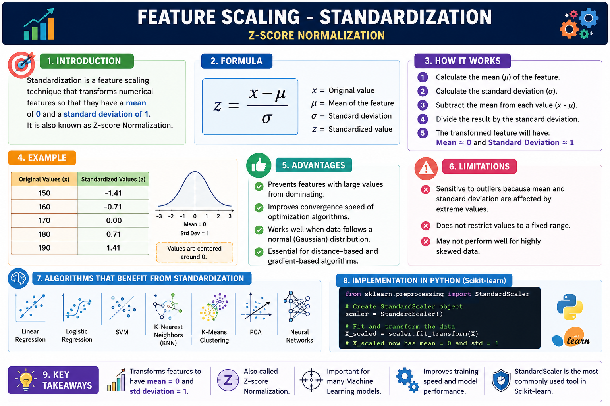

# 🛠️ Feature Scaling - Standardization



## 📌 Introduction

Standardization is a feature scaling technique that transforms numerical features so that they have a **mean of 0** and a **standard deviation of 1**. It is also known as **Z-score Normalization** and is widely used before training machine learning models.

---

## 🎯 Why Standardization?

Machine learning algorithms perform better when features are on a similar scale. Without standardization, features with larger values can dominate those with smaller values.

**Example:**

| Feature | Range |
|---------|------:|
| Age | 18 – 60 |
| Salary | 20,000 – 500,000 |

Here, the **Salary** feature has much larger values than **Age**, which can negatively affect many ML algorithms.

---

## 📐 Standardization Formula

\[
z = \frac{x - \mu}{\sigma}
\]

Where:

- **x** = Original value
- **μ** = Mean of the feature
- **σ** = Standard deviation
- **z** = Standardized value

---

## ⚙️ How Standardization Works

1. Calculate the mean of the feature.
2. Calculate the standard deviation.
3. Subtract the mean from each value.
4. Divide the result by the standard deviation.
5. The transformed feature will have:
   - Mean ≈ **0**
   - Standard Deviation ≈ **1**

---

## 📊 Example

Original values:

```text
[150, 160, 170, 180, 190]
```

After Standardization:

```text
[-1.41, -0.71, 0.00, 0.71, 1.41]
```

Notice that the data is now centered around **0**.

---

## ✅ Advantages

- Prevents features with large values from dominating.
- Improves model convergence.
- Works well for normally distributed data.
- Essential for many machine learning algorithms.

---

## ❌ Limitations

- Sensitive to outliers.
- Does not limit values to a fixed range.
- Less effective for highly skewed data.

---

## 🤖 Algorithms That Require Standardization

- Linear Regression
- Logistic Regression
- Support Vector Machine (SVM)
- K-Nearest Neighbors (KNN)
- K-Means Clustering
- Principal Component Analysis (PCA)
- Neural Networks

---

## 💻 Scikit-learn Implementation

```python
from sklearn.preprocessing import StandardScaler

scaler = StandardScaler()

X_scaled = scaler.fit_transform(X)
```

---

## 📌 Key Takeaways

- Standardization is also called **Z-score Normalization**.
- It transforms data to have **mean = 0** and **standard deviation = 1**.
- It is recommended for distance-based and gradient-based algorithms.
- It improves training speed and model performance.
- Scikit-learn provides the **StandardScaler** class for easy implementation.

---

## 📚 Conclusion

Standardization is one of the most commonly used feature scaling techniques in Machine Learning. It ensures that all numerical features contribute equally to model training, leading to faster convergence and more reliable predictions.