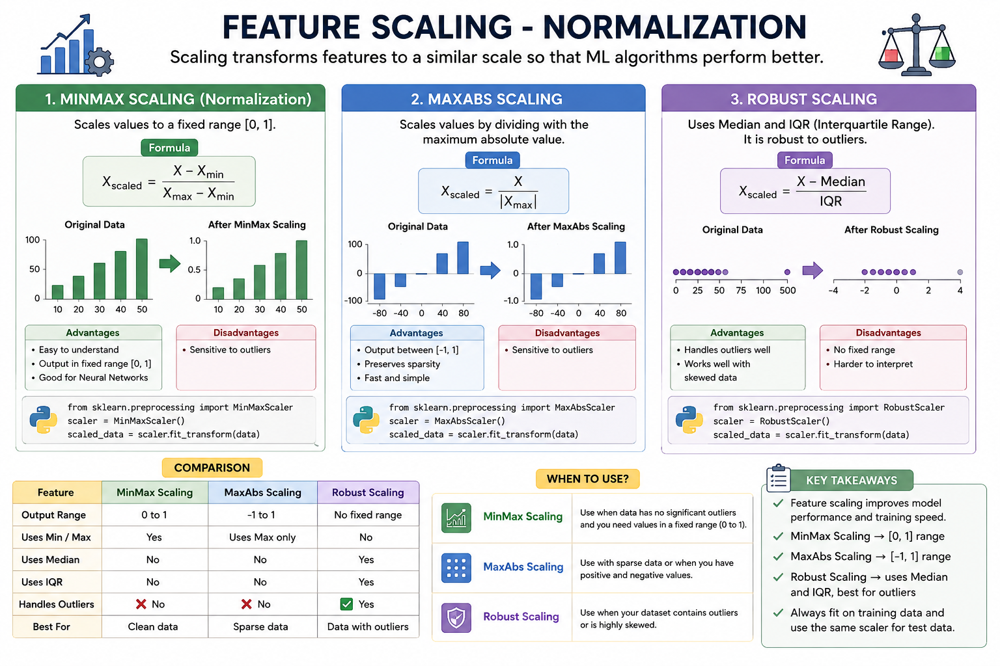

# Feature Scaling - Normalization | MinMax Scaling | MaxAbs Scaling | Robust Scaling



## Introduction

Feature Scaling is the process of bringing numerical features to a similar scale. It helps Machine Learning models learn faster and perform better, especially algorithms that use distance calculations or gradient descent.

**Normalization** is a feature scaling technique that rescales the values of a feature without changing their relationships.

---

# Why Feature Scaling?

Feature scaling is important because it:

- Prevents large-value features from dominating smaller ones.
- Improves model accuracy.
- Speeds up training.
- Helps distance-based algorithms perform better.

---

# 1. MinMax Scaling

### Definition

MinMax Scaling scales data to a fixed range, usually **0 to 1**.

### Formula

\[
X_{scaled}=\frac{X-X_{min}}{X_{max}-X_{min}}
\]

### Example

Original: `10, 20, 30, 40`

Scaled: `0.0, 0.33, 0.67, 1.0`

### Advantages

- Easy to understand.
- Keeps values between 0 and 1.
- Good for Neural Networks.

### Disadvantages

- Sensitive to outliers.

### Python Example

```python
from sklearn.preprocessing import MinMaxScaler

scaler = MinMaxScaler()
scaled_data = scaler.fit_transform(data)
```

---

# 2. MaxAbs Scaling

### Definition

MaxAbs Scaling divides each value by the maximum absolute value of the feature.

The scaled values lie between **-1 and 1**.

### Formula

\[
X_{scaled}=\frac{X}{|X_{max}|}
\]

### Example

Original: `-20, 40, 80`

Scaled: `-0.25, 0.50, 1.00`

### Advantages

- Works well with sparse data.
- Keeps zero values unchanged.

### Disadvantages

- Sensitive to outliers.

### Python Example

```python
from sklearn.preprocessing import MaxAbsScaler

scaler = MaxAbsScaler()
scaled_data = scaler.fit_transform(data)
```

---

# 3. Robust Scaling

### Definition

Robust Scaling uses the **Median** and **Interquartile Range (IQR)** instead of minimum and maximum values.

It works well when the dataset contains outliers.

### Formula

\[
X_{scaled}=\frac{X-\text{Median}}{\text{IQR}}
\]

### Advantages

- Handles outliers well.
- Suitable for skewed data.

### Disadvantages

- Values are not limited to a fixed range.

### Python Example

```python
from sklearn.preprocessing import RobustScaler

scaler = RobustScaler()
scaled_data = scaler.fit_transform(data)
```

---

# Comparison

| Technique | Output Range | Handles Outliers |
|------------|--------------|------------------|
| MinMax Scaling | 0 to 1 | ❌ No |
| MaxAbs Scaling | -1 to 1 | ❌ No |
| Robust Scaling | No fixed range | ✅ Yes |

---

# When to Use

- **MinMax Scaling:** Clean datasets with few outliers.
- **MaxAbs Scaling:** Sparse data or data with positive and negative values.
- **Robust Scaling:** Datasets containing many outliers.

---

# Summary

- Feature Scaling makes numerical features comparable.
- **MinMax Scaling** scales values between **0 and 1**.
- **MaxAbs Scaling** scales values between **-1 and 1**.
- **Robust Scaling** uses the **Median** and **IQR**, making it resistant to outliers.
- Choose the scaling technique based on your dataset.