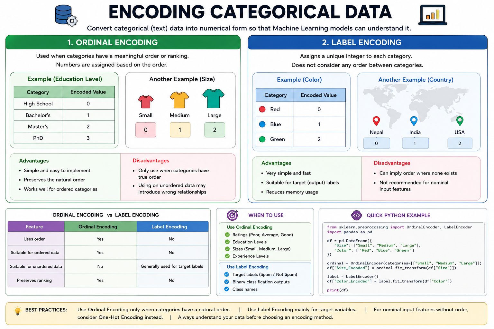

# Encoding Categorical Data



## Introduction

Machine Learning models work with numerical data, not text. Categorical data contains values such as **Red, Blue, Green** or **Low, Medium, High**, which must be converted into numbers before training a model.

This process is called **Encoding Categorical Data**.

---

# What is Categorical Data?

Categorical data represents labels or categories instead of numerical values.

### Example

| Color | Size |
|--------|------|
| Red | Small |
| Blue | Medium |
| Green | Large |

Since ML algorithms cannot directly understand these text values, they need to be encoded.

---

# Types of Encoding

There are multiple techniques to encode categorical data. Two of the most common are:

- Ordinal Encoding
- Label Encoding

---

# 1. Ordinal Encoding

Ordinal Encoding is used when the categories have a **meaningful order or ranking**.

Each category is assigned a numerical value based on its order.

### Example

| Education Level | Encoded Value |
|-----------------|--------------:|
| High School | 0 |
| Bachelor's | 1 |
| Master's | 2 |
| PhD | 3 |

Another Example:

| Size | Encoded Value |
|------|--------------:|
| Small | 0 |
| Medium | 1 |
| Large | 2 |

### Advantages

- Simple and easy to implement.
- Preserves the natural order of categories.
- Works well for ordered categorical features.

### Disadvantages

- Should only be used when categories have a true order.
- Using it on unordered categories may introduce incorrect relationships.

---

# 2. Label Encoding

Label Encoding assigns a unique integer to every category.

Unlike Ordinal Encoding, it **does not consider any order** between categories.

### Example

| Color | Encoded Value |
|--------|--------------:|
| Red | 0 |
| Blue | 1 |
| Green | 2 |

The assigned numbers are simply identifiers.

### Advantages

- Very simple and fast.
- Suitable for encoding target (output) labels.
- Reduces memory usage compared to text values.

### Disadvantages

- Can mistakenly imply an order where none exists.
- Not recommended for nominal input features in many ML models.

---

# Ordinal Encoding vs Label Encoding

| Feature | Ordinal Encoding | Label Encoding |
|---------|------------------|----------------|
| Uses order | Yes | No |
| Suitable for ordered data | Yes | No |
| Suitable for unordered data | No | Generally used for target labels |
| Preserves ranking | Yes | No |

---

# When to Use

### Use Ordinal Encoding

- Ratings (Poor, Average, Good)
- Education Levels
- Sizes (Small, Medium, Large)
- Experience Levels

### Use Label Encoding

- Target labels (Spam/Not Spam)
- Binary classification outputs
- Class names

---

# Python Example

```python
from sklearn.preprocessing import OrdinalEncoder, LabelEncoder
import pandas as pd

# Sample data
df = pd.DataFrame({
    "Size": ["Small", "Medium", "Large"],
    "Color": ["Red", "Blue", "Green"]
})

# Ordinal Encoding
ordinal = OrdinalEncoder(categories=[["Small", "Medium", "Large"]])
df["Size_Encoded"] = ordinal.fit_transform(df[["Size"]])

# Label Encoding
label = LabelEncoder()
df["Color_Encoded"] = label.fit_transform(df["Color"])

print(df)
```

### Output

```
     Size  Color  Size_Encoded  Color_Encoded
0   Small    Red           0.0              2
1  Medium   Blue           1.0              0
2   Large  Green           2.0              1
```

---

# Best Practices

- Use **Ordinal Encoding** only when the categories have a natural order.
- Use **Label Encoding** mainly for target variables.
- For nominal input features without order, consider **One-Hot Encoding** instead.
- Always understand the meaning of your categorical data before choosing an encoding method.

---

# Summary

Encoding categorical data converts text categories into numerical values that Machine Learning models can understand.

- **Ordinal Encoding** preserves the order of categories and is suitable for ordered data.
- **Label Encoding** assigns unique numbers without considering order and is commonly used for target labels.

Choosing the correct encoding technique helps improve model performance and prevents misleading relationships in the data.