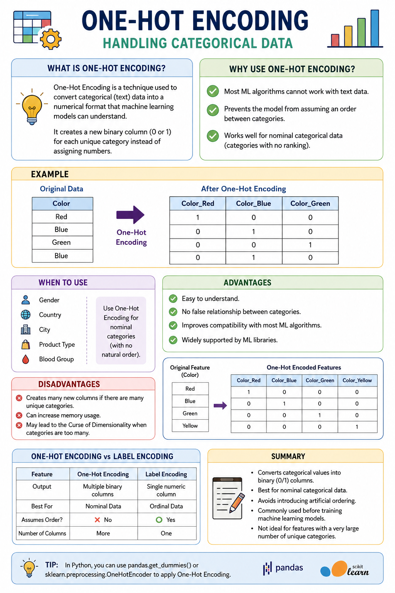

# One-Hot Encoding | Handling Categorical Data

## What is One-Hot Encoding?

One-Hot Encoding is a technique used to convert **categorical (text) data** into a numerical format that machine learning models can understand.

Instead of assigning numbers to categories, it creates a **new binary column (0 or 1)** for each unique category.

---

## Why Use One-Hot Encoding?

- Most ML algorithms cannot work with text data.
- Prevents the model from assuming an order between categories.
- Works well for **nominal categorical data** (categories with no ranking).

---

## Example

Original Data:

| Color |
|-------|
| Red |
| Blue |
| Green |
| Blue |

After One-Hot Encoding:

| Color_Red | Color_Blue | Color_Green |
|-----------|------------|-------------|
| 1 | 0 | 0 |
| 0 | 1 | 0 |
| 0 | 0 | 1 |
| 0 | 1 | 0 |

---

## When to Use

- Nominal categories
  - Gender
  - Country
  - City
  - Product Type
  - Blood Group

---

## Advantages

- Easy to understand.
- No false relationship between categories.
- Improves compatibility with most ML algorithms.
- Widely supported by ML libraries.

---

## Disadvantages

- Creates many new columns if there are many unique categories.
- Can increase memory usage.
- May lead to the **Curse of Dimensionality** when categories are too many.

---

## One-Hot Encoding vs Label Encoding

| Feature | One-Hot Encoding | Label Encoding |
|---------|------------------|----------------|
| Output | Multiple binary columns | Single numeric column |
| Best For | Nominal Data | Ordinal Data |
| Assumes Order? | ❌ No | ✅ Yes |
| Number of Columns | More | One |

---

## Summary

- Converts categorical values into binary (0/1) columns.
- Best for **nominal categorical data**.
- Avoids introducing artificial ordering.
- Commonly used before training machine learning models.
- Not ideal for features with a very large number of unique categories.