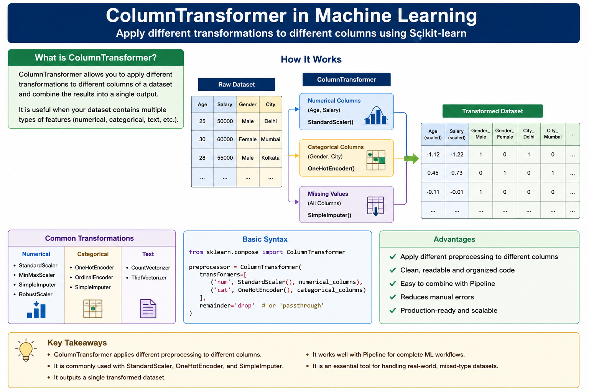

# Column Transformer in Machine Learning | How to use ColumnTransformer in Scikit-learn




## What is ColumnTransformer?

`ColumnTransformer` is a preprocessing tool in **Scikit-learn** that allows you to apply **different transformations to different columns** of a dataset.

It is mainly used when a dataset contains multiple types of features, such as:
- Numerical columns
- Categorical columns
- Text columns

Instead of preprocessing each column separately, `ColumnTransformer` combines everything into a single pipeline.

---

## Why Use ColumnTransformer?

- Apply different preprocessing techniques to different columns.
- Keep preprocessing organized and clean.
- Prevent manual errors.
- Easily integrate with Machine Learning pipelines.
- Make code reusable and production-ready.

---

## Common Transformations

### Numerical Columns
- StandardScaler
- MinMaxScaler
- SimpleImputer
- RobustScaler

### Categorical Columns
- OneHotEncoder
- OrdinalEncoder
- SimpleImputer

### Text Columns
- CountVectorizer
- TfidfVectorizer

---

## How ColumnTransformer Works

1. Select the columns.
2. Choose the transformer for each group.
3. Apply all transformations together.
4. Combine the transformed columns into a single dataset.

```
Dataset
│
├── Age, Salary ─────► StandardScaler
│
├── Gender, City ────► OneHotEncoder
│
└── Missing Values ──► SimpleImputer
         │
         ▼
   ColumnTransformer
         │
         ▼
  Processed Dataset
```

---

## Basic Syntax

```python
from sklearn.compose import ColumnTransformer

preprocessor = ColumnTransformer(
    transformers=[
        ('num', StandardScaler(), numerical_columns),
        ('cat', OneHotEncoder(), categorical_columns)
    ]
)
```

---

## Advantages

- Clean and readable code.
- Handles multiple feature types together.
- Easy to combine with `Pipeline`.
- Reduces preprocessing mistakes.
- Works well for real-world datasets.

---

## Limitations

- Initial setup can be slightly complex.
- Need to specify column names or indices correctly.
- Some transformers require additional parameter tuning.

---

# Best Practice

Use **ColumnTransformer** whenever your dataset contains different types of features that require different preprocessing methods. It keeps your preprocessing workflow organized, scalable, and easy to integrate into machine learning pipelines.

---

## Key Takeaways

- `ColumnTransformer` applies different preprocessing to different columns.
- Commonly used with **StandardScaler**, **OneHotEncoder**, and **SimpleImputer**.
- Produces a single transformed dataset.
- Frequently combined with **Pipeline** for complete ML workflows.
- Essential for preprocessing mixed-type datasets in Scikit-learn.