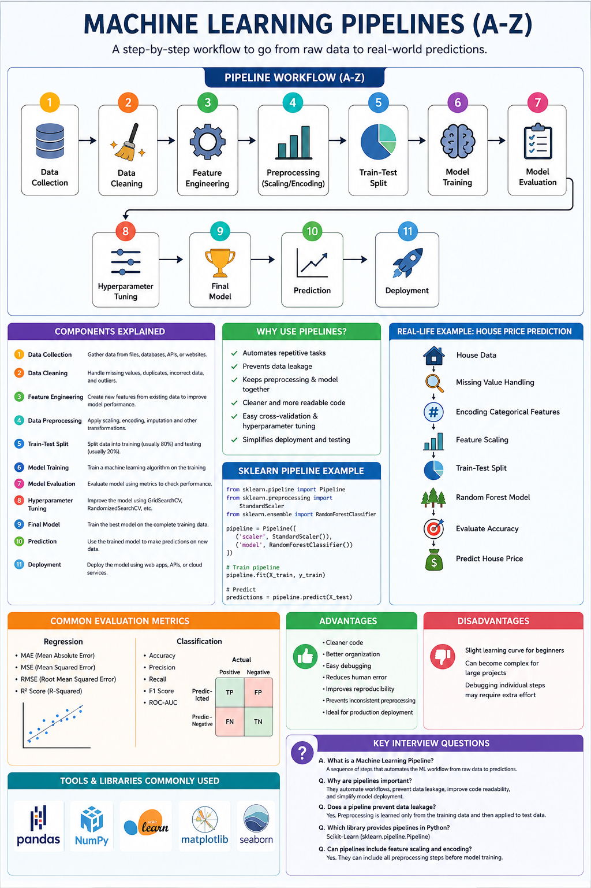

# Machine Learning Pipelines (A-Z)



## What is a Machine Learning Pipeline?

A **Machine Learning Pipeline** is a sequence of steps that automates the complete machine learning workflow, from loading data to making predictions. It helps keep the code clean, reusable, and prevents data leakage.

---

# Why Use Pipelines?

- Automates repetitive tasks.
- Keeps preprocessing and model training together.
- Prevents data leakage.
- Makes code cleaner and easier to maintain.
- Simplifies deployment and testing.
- Works well with cross-validation and hyperparameter tuning.

---

# Machine Learning Pipeline Workflow (A-Z)

```
Data Collection
        │
        ▼
Data Cleaning
        │
        ▼
Feature Engineering
        │
        ▼
Feature Scaling / Encoding
        │
        ▼
Train-Test Split
        │
        ▼
Model Training
        │
        ▼
Model Evaluation
        │
        ▼
Hyperparameter Tuning
        │
        ▼
Final Model
        │
        ▼
Prediction
        │
        ▼
Deployment
```

---

# Components of a Pipeline

## 1. Data Collection
Gather data from files, databases, APIs, or websites.

Example:
- CSV
- Excel
- SQL Database
- API

---

## 2. Data Cleaning

Remove or fix:
- Missing values
- Duplicate rows
- Incorrect data
- Outliers (if necessary)

---

## 3. Feature Engineering

Create useful features from existing data.

Examples:
- Extract Year from Date
- Calculate Age
- Combine columns

---

## 4. Data Preprocessing

Prepare data for machine learning.

Common preprocessing:
- Missing Value Imputation
- Label Encoding
- One Hot Encoding
- Standardization
- Normalization

---

## 5. Train-Test Split

Split the dataset.

Typical ratio:

- Train → 80%
- Test → 20%

---

## 6. Model Training

Train a machine learning algorithm.

Examples:
- Linear Regression
- Logistic Regression
- Decision Tree
- Random Forest
- SVM
- KNN

---

## 7. Model Evaluation

Measure model performance.

Regression:
- MAE
- MSE
- RMSE
- R² Score

Classification:
- Accuracy
- Precision
- Recall
- F1 Score
- ROC-AUC

---

## 8. Hyperparameter Tuning

Improve model performance using:

- GridSearchCV
- RandomizedSearchCV

---

## 9. Final Model

Train the best-performing model on the complete training data.

---

## 10. Prediction

Use the trained model to predict outcomes for new, unseen data.

---

## 11. Deployment

Deploy the model using:

- Flask
- FastAPI
- Django
- Streamlit
- Docker
- Cloud Services (AWS, Azure, GCP)

---

# Pipeline in Scikit-Learn

Scikit-Learn provides the `Pipeline` class to chain preprocessing and model training into a single object.

Basic structure:

```python
Pipeline([
    ("preprocessing", PreprocessingStep),
    ("model", MachineLearningModel)
])
```

---

# Benefits of Scikit-Learn Pipeline

- One-line training
- One-line prediction
- Prevents data leakage
- Cleaner code
- Easy cross-validation
- Easy hyperparameter tuning
- Reusable workflow

---

# Advantages

- Cleaner code
- Better organization
- Easy debugging
- Reduces human error
- Improves reproducibility
- Prevents inconsistent preprocessing
- Ideal for production deployment

---

# Disadvantages

- Slight learning curve for beginners
- Can become complex for large projects
- Debugging individual steps may require extra effort

---

# Real-Life Example

**House Price Prediction**

```
House Data
     │
     ▼
Missing Value Handling
     │
     ▼
Encoding Categorical Features
     │
     ▼
Feature Scaling
     │
     ▼
Train-Test Split
     │
     ▼
Random Forest Model
     │
     ▼
Evaluate Accuracy
     │
     ▼
Predict House Price
```

---

# Key Interview Questions

### What is a Machine Learning Pipeline?
A Machine Learning Pipeline is an automated sequence of preprocessing and model-building steps that transforms raw data into predictions.

### Why are pipelines important?
They automate workflows, prevent data leakage, improve code readability, and simplify model deployment.

### Does a pipeline prevent data leakage?
**Yes.** Preprocessing is learned only from the training data and then applied to the test data.

### Which library provides pipelines in Python?
**Scikit-Learn (`sklearn.pipeline.Pipeline`)**

### Can pipelines include feature scaling and encoding?
**Yes.** They can include all preprocessing steps before model training.

---

# Summary

A Machine Learning Pipeline combines data preprocessing, feature engineering, model training, and prediction into one reusable workflow. It improves code quality, prevents data leakage, and makes machine learning projects easier to build, evaluate, and deploy.