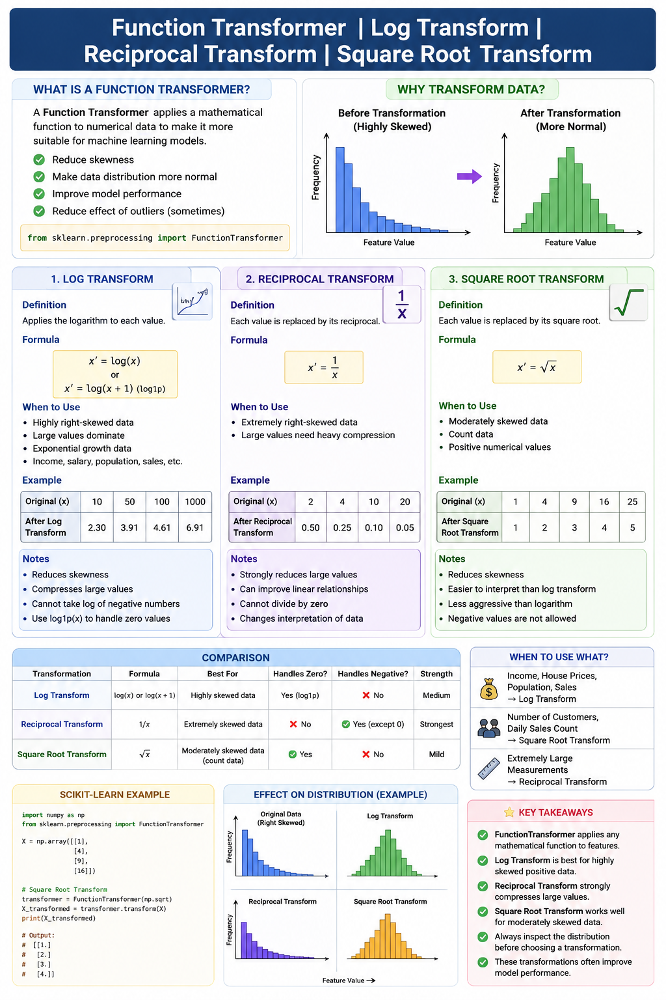

# Function Transformer | Log Transform | Reciprocal Transform | Square Root Transform



## 📌 What is a Function Transformer?

A **Function Transformer** is a preprocessing technique used to apply mathematical functions to numerical features. It helps transform data into a form that machine learning models can understand more effectively.

It is mainly used to:
- Reduce skewness in data
- Make the data distribution more normal
- Improve model performance
- Reduce the effect of outliers (depending on the transformation)

In **Scikit-learn**, the `FunctionTransformer` class allows you to apply any custom or built-in mathematical function to features.

```python
from sklearn.preprocessing import FunctionTransformer
```

---

# 1. Log Transform

### Definition
Log Transform applies the logarithm to each value in a feature.

### Formula

\[
x' = \log(x)
\]

or

\[
x' = \log(x+1)
\]

(`log1p()` is commonly used because it safely handles zero values.)

### When to Use
- Data is highly right-skewed
- Large values dominate the dataset
- Exponential growth data
- Income, salary, population, sales, etc.

### Advantages
- Reduces skewness
- Compresses large values
- Makes data closer to a normal distribution

### Limitations
- Cannot take the log of negative numbers.
- Zero values require `log(x+1)`.

### Example

Original:

```
10
50
100
1000
```

After Log Transform:

```
2.30
3.91
4.61
6.91
```

---

# 2. Reciprocal Transform

### Definition

Each value is replaced by its reciprocal.

### Formula

\[
x' = \frac{1}{x}
\]

### When to Use

- Extremely right-skewed data
- Large values need heavy compression

### Advantages

- Strongly reduces large values
- Can improve linear relationships

### Limitations

- Cannot divide by zero
- Changes interpretation of data

### Example

Original

```
2
4
10
20
```

After Reciprocal Transform

```
0.50
0.25
0.10
0.05
```

---

# 3. Square Root Transform

### Definition

Each value is replaced by its square root.

### Formula

\[
x' = \sqrt{x}
\]

### When to Use

- Moderately skewed data
- Count data
- Positive numerical values

### Advantages

- Reduces skewness
- Easier to interpret than log transform
- Less aggressive than logarithm

### Limitations

- Negative values are not allowed.

### Example

Original

```
1
4
9
16
25
```

After Square Root Transform

```
1
2
3
4
5
```

---

# FunctionTransformer Example in Scikit-learn

```python
import numpy as np
from sklearn.preprocessing import FunctionTransformer

X = np.array([[1],
              [4],
              [9],
              [16]])

transformer = FunctionTransformer(np.sqrt)

X_transformed = transformer.transform(X)

print(X_transformed)
```

---

# Comparison

| Transformation | Formula | Best For | Handles Zero? | Handles Negative? |
|---------------|----------|----------|---------------|-------------------|
| Log Transform | log(x) | Highly skewed data | Yes (`log1p`) | ❌ No |
| Reciprocal Transform | 1/x | Extremely skewed data | ❌ No | ✔ Yes (except 0) |
| Square Root Transform | √x | Moderately skewed data | ✔ Yes | ❌ No |

---

# Real-Life Examples

| Dataset | Recommended Transform |
|----------|-----------------------|
| Income | Log Transform |
| House Prices | Log Transform |
| Population | Log Transform |
| Number of Customers | Square Root Transform |
| Daily Sales Count | Square Root Transform |
| Extremely Large Measurements | Reciprocal Transform |

---

# Key Points

- FunctionTransformer applies custom mathematical transformations.
- Log Transform is best for highly skewed positive data.
- Reciprocal Transform strongly compresses large values.
- Square Root Transform is useful for moderately skewed count data.
- Always inspect the data distribution before selecting a transformation.
- These transformations often improve machine learning model performance.

---

## 🚀 Interview Questions

### 1. What is a Function Transformer?
A preprocessing tool that applies mathematical functions to numerical features.

### 2. Why do we use Log Transform?
To reduce skewness and make data more normally distributed.

### 3. Which transformation is stronger: Log or Square Root?
**Log Transform** is generally stronger than Square Root Transform.

### 4. Can Log Transform handle negative values?
No.

### 5. Which transform uses the formula 1/x?
Reciprocal Transform.

### 6. Which transform is suitable for count data?
Square Root Transform.

### 7. Why do we use `log1p()` instead of `log()`?
Because `log1p(x)` safely handles zero values by computing `log(x + 1)`.

---

# ✅ Summary

Function Transformers apply mathematical operations to numerical data before training a machine learning model. Log Transform is ideal for highly skewed data, Reciprocal Transform provides the strongest compression of large values, and Square Root Transform works well for moderately skewed positive data. Choosing the right transformation helps improve data distribution, reduces skewness, and often increases model accuracy.