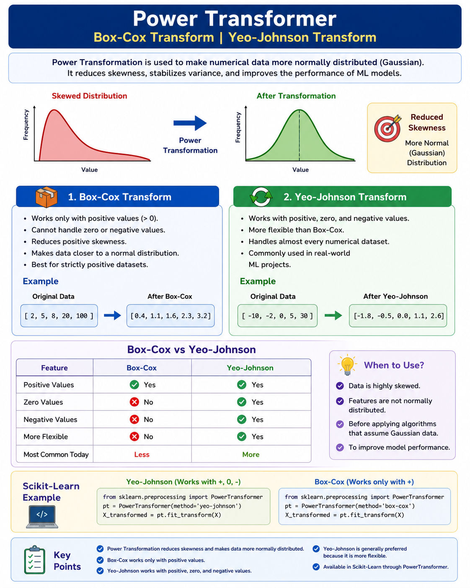

"""
=========================================================
Power Transformer | Box-Cox Transform | Yeo-Johnson Transform

=========================================================

Power Transformation is used to make numerical data more
normally distributed (Gaussian). It reduces skewness,
stabilizes variance, and improves the performance of
machine learning models.

---------------------------------------------------------
1. Box-Cox Transformation
---------------------------------------------------------
- Works only with positive values (> 0).
- Cannot handle zero or negative values.
- Reduces positive skewness.
- Makes data closer to a normal distribution.

Example:
Original Data:
[2, 5, 8, 20, 100]

Transformed Data:
[0.4, 1.1, 1.6, 2.3, 3.2]

---------------------------------------------------------
2. Yeo-Johnson Transformation
---------------------------------------------------------
- Works with positive, zero, and negative values.
- More flexible than Box-Cox.
- Commonly used in real-world ML projects.

Example:
Original Data:
[-10, -2, 0, 5, 30]

Transformed Data:
[-1.8, -0.5, 0.0, 1.1, 2.6]

---------------------------------------------------------
Box-Cox vs Yeo-Johnson
---------------------------------------------------------

Feature               Box-Cox      Yeo-Johnson
----------------------------------------------
Positive Values         ✔              ✔
Zero Values             ✘              ✔
Negative Values         ✘              ✔
More Flexible           ✘              ✔
Most Common Today       Less           More

---------------------------------------------------------
Scikit-Learn Example
---------------------------------------------------------
"""

from sklearn.preprocessing import PowerTransformer
import pandas as pd

# Sample Data
df = pd.DataFrame({
    "Salary": [25000, 32000, 45000, 52000, 90000]
})

# ------------------------------
# Yeo-Johnson Transformation
# ------------------------------
pt_yj = PowerTransformer(method="yeo-johnson")

df["Salary_YJ"] = pt_yj.fit_transform(df[["Salary"]])

print("Yeo-Johnson Transformation")
print(df)

# ------------------------------
# Box-Cox Transformation
# (Only for positive values)
# ------------------------------
pt_bc = PowerTransformer(method="box-cox")

df["Salary_BC"] = pt_bc.fit_transform(df[["Salary"]])

print("\nBox-Cox Transformation")
print(df)

"""
---------------------------------------------------------
When to Use
---------------------------------------------------------
✔ Data is highly skewed.
✔ Features are not normally distributed.
✔ Before Linear Regression, Logistic Regression,
   PCA, LDA, and similar algorithms.

---------------------------------------------------------
Key Points
---------------------------------------------------------
✔ Power Transformation reduces skewness.
✔ Box-Cox works only for positive values.
✔ Yeo-Johnson works for positive, zero, and negative values.
✔ Yeo-Johnson is generally preferred due to its flexibility.
✔ Implemented in Scikit-Learn using PowerTransformer.
"""

