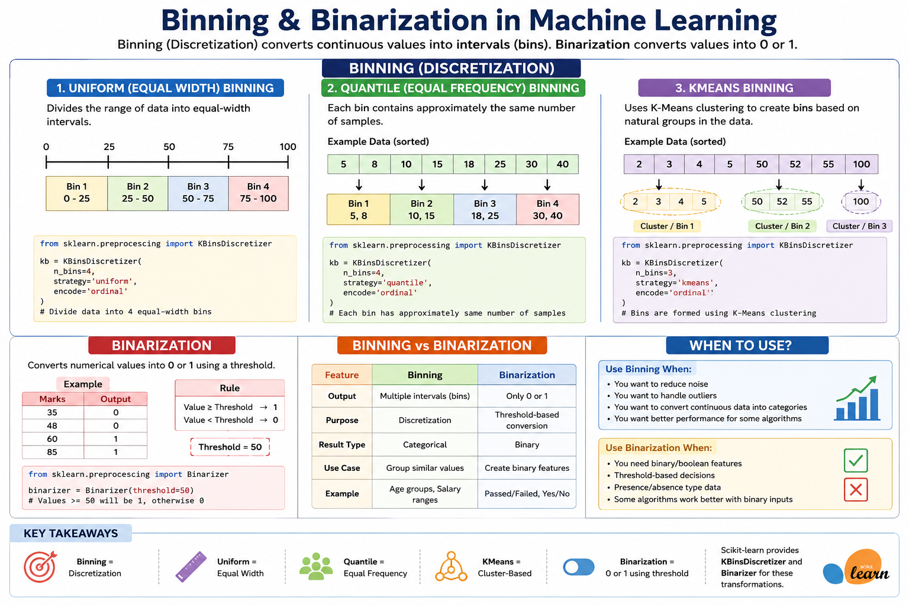

# 📊 Binning & Binarization



**Binning** and **Binarization** are feature engineering techniques used to transform numerical data into a more useful format for Machine Learning.

---

# 📦 Binning (Discretization)

**Binning**, also known as **Discretization**, converts continuous numerical values into a fixed number of intervals (bins).

### ✅ Why Use Binning?

- Reduces noise
- Handles outliers
- Simplifies continuous data
- Improves model performance for some algorithms

---

# 📏 Types of Binning

## 1️⃣ Uniform (Equal Width) Binning

Divides the entire data range into **equal-width intervals**.

```python
from sklearn.preprocessing import KBinsDiscretizer

kb = KBinsDiscretizer(
    n_bins=4,
    strategy="uniform",
    encode="ordinal"
)
```

---

## 2️⃣ Quantile (Equal Frequency) Binning

Each bin contains approximately the **same number of samples**.

**Advantages**

- Works well for skewed data
- Keeps each bin balanced

```python
from sklearn.preprocessing import KBinsDiscretizer

kb = KBinsDiscretizer(
    n_bins=4,
    strategy="quantile",
    encode="ordinal"
)
```

---

## 3️⃣ KMeans Binning

Uses the **K-Means clustering algorithm** to create bins based on the natural distribution of the data.

**Advantages**

- Finds natural groups in the data
- Better for unevenly distributed datasets

```python
from sklearn.preprocessing import KBinsDiscretizer

kb = KBinsDiscretizer(
    n_bins=3,
    strategy="kmeans",
    encode="ordinal"
)
```

---

# ⚫ Binarization

**Binarization** converts numerical values into **0 or 1** using a specified threshold.

### Example

```text
Threshold = 50

Value ≥ 50 → 1
Value < 50 → 0
```

```python
from sklearn.preprocessing import Binarizer

binarizer = Binarizer(threshold=50)
```

---

# 🔥 Binning vs Binarization

| Binning | Binarization |
|----------|--------------|
| Creates multiple intervals | Creates only two values (0 or 1) |
| Used for discretization | Used for threshold-based conversion |
| Produces categorical data | Produces binary data |

---

# 📝 Key Takeaways

- **Binning = Discretization of continuous data**
- **Uniform = Equal Width**
- **Quantile = Equal Frequency**
- **KMeans = Cluster-Based Binning**
- **Binarization = Threshold-based (0 or 1)**
- **Scikit-learn provides `KBinsDiscretizer` and `Binarizer` for these transformations.**