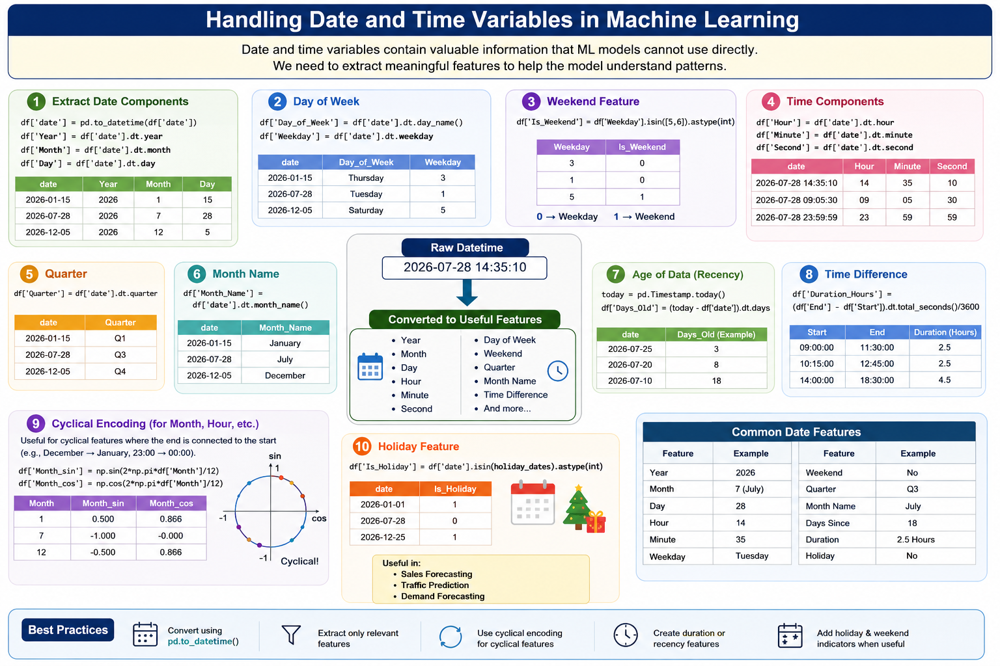

# 🕒 Handling Date and Time Variables in Machine Learning



Date and time features contain valuable information that models cannot use directly. We need **feature engineering** to extract meaningful patterns from datetime values.

---

## 📌 Why Handle Date & Time Variables?

Machine learning models cannot understand raw datetime values like:

```text
2026-07-28 14:35:10
```

Instead, we convert them into useful numerical features such as:

- Year
- Month
- Day
- Hour
- Minute
- Day of Week
- Weekend or Weekday
- Quarter
- Season
- Time Difference

---

# 1️⃣ Extract Date Components

A datetime column can be split into multiple useful features.

### Example

```python
import pandas as pd

df = pd.DataFrame({
    "Purchase_Date": ["2026-01-15", "2026-07-28", "2026-12-05"]
})

df["Purchase_Date"] = pd.to_datetime(df["Purchase_Date"])

df["Year"] = df["Purchase_Date"].dt.year
df["Month"] = df["Purchase_Date"].dt.month
df["Day"] = df["Purchase_Date"].dt.day

print(df)
```

---

# 2️⃣ Extract Day of Week

```python
df["Day_of_Week"] = df["Purchase_Date"].dt.day_name()

print(df)
```

Output

```
Friday
Tuesday
Saturday
```

Can also be numerical:

```python
df["Weekday"] = df["Purchase_Date"].dt.weekday
```

```
Monday = 0
Tuesday = 1
...
Sunday = 6
```

---

# 3️⃣ Weekend Feature

```python
df["Is_Weekend"] = df["Weekday"].isin([5,6]).astype(int)
```

Output

```
0 → Weekday
1 → Weekend
```

---

# 4️⃣ Extract Time Components

```python
df["Hour"] = df["Purchase_Date"].dt.hour
df["Minute"] = df["Purchase_Date"].dt.minute
df["Second"] = df["Purchase_Date"].dt.second
```

Useful for:

- Ride demand prediction
- Traffic analysis
- Energy consumption
- Online activity prediction

---

# 5️⃣ Quarter

```python
df["Quarter"] = df["Purchase_Date"].dt.quarter
```

Output

```
Q1
Q2
Q3
Q4
```

---

# 6️⃣ Month Name

```python
df["Month_Name"] = df["Purchase_Date"].dt.month_name()
```

Output

```
January
July
December
```

---

# 7️⃣ Calculate Age of Data

Difference between two dates.

```python
today = pd.Timestamp.today()

df["Days_Old"] = (today - df["Purchase_Date"]).dt.days
```

Useful for:

- Customer recency
- Product age
- Subscription duration

---

# 8️⃣ Time Difference Between Events

```python
df = pd.DataFrame({
    "Start":["2026-07-28 09:00:00"],
    "End":["2026-07-28 11:30:00"]
})

df["Start"] = pd.to_datetime(df["Start"])
df["End"] = pd.to_datetime(df["End"])

df["Duration"] = (df["End"] - df["Start"]).dt.total_seconds()/3600

print(df["Duration"])
```

Output

```
2.5 Hours
```

---

# 9️⃣ Cyclical Encoding

Months and hours are cyclical.

```
December → January
23:00 → 00:00
```

Encode using sine and cosine.

```python
import numpy as np

df["Month_sin"] = np.sin(2*np.pi*df["Month"]/12)
df["Month_cos"] = np.cos(2*np.pi*df["Month"]/12)
```

This preserves cyclical relationships.

---

# 🔟 Holiday Feature

```python
df["Is_Holiday"] = df["Purchase_Date"].isin(holiday_dates).astype(int)
```

Useful in:

- Sales forecasting
- Traffic prediction
- Demand forecasting

---

# Common Date Features

| Feature | Example |
|----------|---------|
| Year | 2026 |
| Month | 7 |
| Day | 28 |
| Hour | 14 |
| Minute | 35 |
| Weekday | Tuesday |
| Weekend | Yes/No |
| Quarter | Q3 |
| Month Name | July |
| Days Since | 120 |
| Duration | 5 Hours |
| Holiday | Yes/No |

---

# Best Practices

- Convert columns using `pd.to_datetime()`.
- Extract only features relevant to the problem.
- Encode cyclical variables (month, hour) using sine/cosine.
- Create duration or recency features where applicable.
- Add holiday and weekend indicators for time-series tasks.

---

# Key Takeaway

Raw date and time values are rarely useful for machine learning. Extracting meaningful features such as **year, month, weekday, hour, duration, recency, and cyclical encodings** helps models uncover temporal patterns and significantly improves predictive performance.