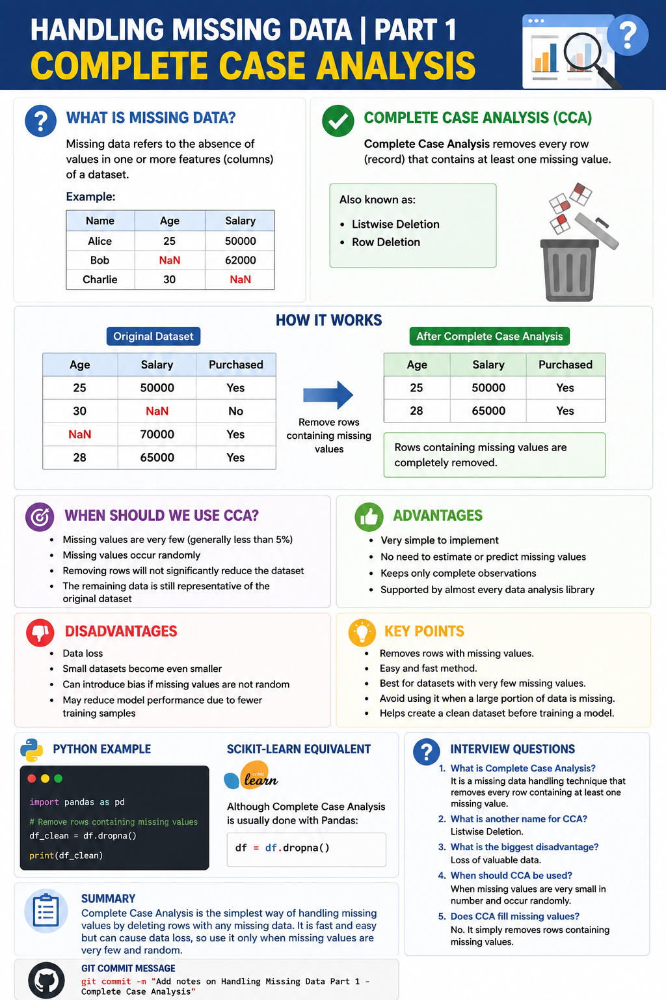

# Handling Missing Data | Part 1 | Complete Case Analysis



## 📌 What is Missing Data?
Missing data refers to the absence of values in one or more features (columns) of a dataset. It is one of the most common problems in real-world machine learning and data analysis.

Example:

| Name | Age | Salary |
|------|----:|-------:|
| Alice | 25 | 50000 |
| Bob | NaN | 62000 |
| Charlie | 30 | NaN |

---

# Complete Case Analysis (CCA)

Complete Case Analysis is one of the simplest techniques for handling missing values.

**Definition:**
Complete Case Analysis removes every row (record) that contains at least one missing value.

It is also known as:
- Listwise Deletion
- Row Deletion

---

## How it Works

Original Dataset

| Age | Salary | Purchased |
|----:|-------:|-----------|
| 25 | 50000 | Yes |
| 30 | NaN | No |
| NaN | 70000 | Yes |
| 28 | 65000 | Yes |

After Complete Case Analysis

| Age | Salary | Purchased |
|----:|-------:|-----------|
| 25 | 50000 | Yes |
| 28 | 65000 | Yes |

Rows containing missing values are completely removed.

---

# When Should We Use Complete Case Analysis?

Use CCA when:

- Missing values are very few (generally less than 5%)
- Missing values occur randomly
- Removing rows will not significantly reduce the dataset
- The remaining data is still representative of the original dataset

---

# Advantages

- Very simple to implement
- No need to estimate or predict missing values
- Keeps only complete observations
- Supported by almost every data analysis library

---

# Disadvantages

- Data loss
- Small datasets become even smaller
- Can introduce bias if missing values are not random
- May reduce model performance due to fewer training samples

---

# Python Example

```python
import pandas as pd

# Remove rows containing missing values
df_clean = df.dropna()

print(df_clean)
```

---

# Scikit-learn Equivalent

Although Complete Case Analysis is usually done with Pandas:

```python
df = df.dropna()
```

No special sklearn transformer is required.

---

# Key Points

- Removes rows with missing values.
- Easy and fast method.
- Best for datasets with very few missing values.
- Avoid using it when a large portion of data is missing.
- Helps create a clean dataset before training a model.

---

# Interview Questions

### 1. What is Complete Case Analysis?
It is a missing data handling technique that removes every row containing at least one missing value.

### 2. What is another name for Complete Case Analysis?
Listwise Deletion.

### 3. What is the biggest disadvantage?
Loss of valuable data.

### 4. When should Complete Case Analysis be used?
When missing values are very small in number and occur randomly.

### 5. Does Complete Case Analysis fill missing values?
No. It simply removes rows containing missing values.

---

# Git Commit Message

```bash
git add .
git commit -m "Add notes on Handling Missing Data Part 1 - Complete Case Analysis"
git push origin main
```