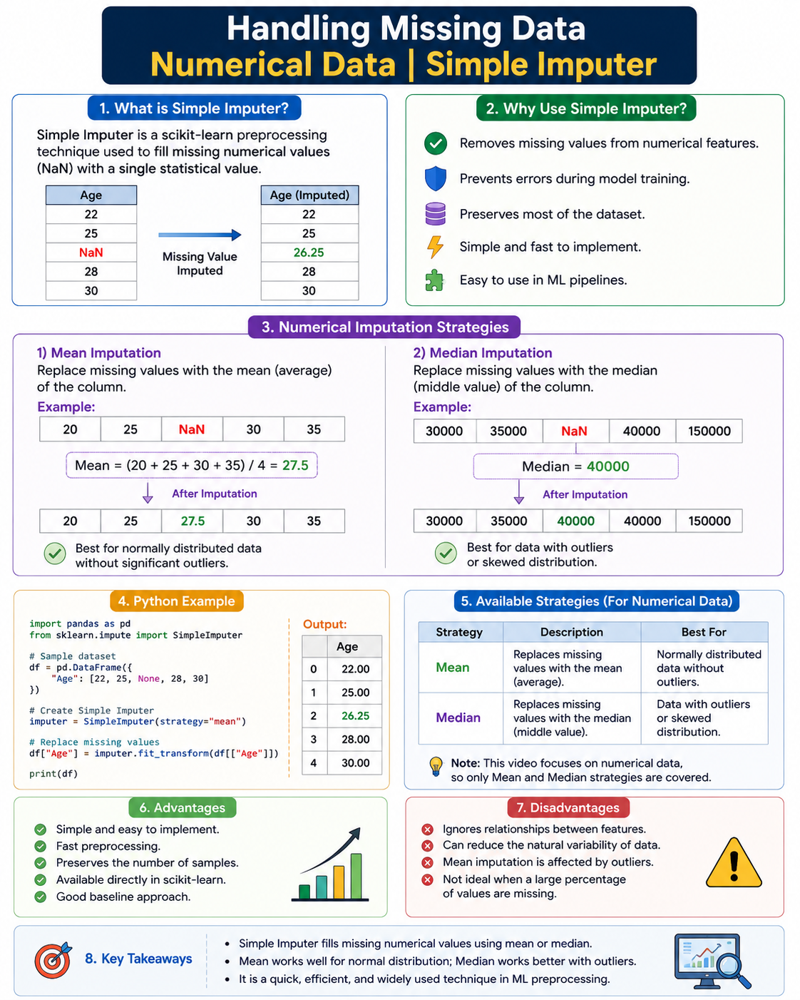

# Handling Missing Data | Numerical Data | Simple Imputer



## 📌 Introduction

Real-world datasets often contain **missing values (NaN)** due to human errors, system failures, survey non-responses, or data corruption. Most machine learning algorithms cannot work directly with missing values, so they must be handled before training the model.

One of the simplest and most commonly used techniques is the **Simple Imputer** provided by Scikit-learn.

---

# What is Simple Imputer?

**Simple Imputer** is a preprocessing class from Scikit-learn that replaces missing values using a single statistical value calculated from the available data.

Instead of deleting rows or columns containing missing values, it fills them with a meaningful value so that no information is unnecessarily lost.

---

# Why Use Simple Imputer?

- Handles missing numerical values efficiently.
- Prevents model training errors caused by `NaN`.
- Preserves most of the dataset.
- Very easy to implement.
- Works well as a baseline imputation technique.
- Can be used inside Scikit-learn Pipelines.

---

# Numerical Imputation Strategies

## 1️⃣ Mean Imputation

The missing values are replaced with the **average (mean)** of all available values.

### Example

Age:

```
20
25
NaN
30
35
```

Mean = (20 + 25 + 30 + 35) / 4 = **27.5**

After Imputation:

```
20
25
27.5
30
35
```

### Best Used When

- Data is approximately normally distributed.
- There are very few outliers.

### Limitation

Large outliers can significantly change the mean.

---

## 2️⃣ Median Imputation

The missing values are replaced with the **median (middle value)** of the column.

### Example

Salary:

```
30000
35000
NaN
40000
150000
```

Median = **40000**

After Imputation

```
30000
35000
40000
40000
150000
```

### Best Used When

- Data contains outliers.
- Data is skewed.

### Why?

The median is not affected much by extremely large or small values.

---

# Python Example

```python
import pandas as pd
from sklearn.impute import SimpleImputer

# Sample dataset
df = pd.DataFrame({
    "Age": [22, 25, None, 28, 30]
})

# Create Simple Imputer
imputer = SimpleImputer(strategy="mean")

# Replace missing values
df["Age"] = imputer.fit_transform(df[["Age"]])

print(df)
```

### Output

```text
    Age
0  22.00
1  25.00
2  26.25
3  28.00
4  30.00
```

---

# Available Strategies

| Strategy | Description | Best For |
|----------|-------------|----------|
| Mean | Replaces with average | Normal distribution |
| Median | Replaces with middle value | Data with outliers |

> **Note:** This video focuses on numerical data, so only **Mean** and **Median** strategies are covered.

---

# Advantages

- Simple and fast.
- Easy to understand.
- Preserves the number of samples.
- Available directly in Scikit-learn.
- Good starting point for data preprocessing.

---

# Disadvantages

- Ignores relationships between features.
- Can reduce the natural variability of data.
- Mean imputation performs poorly when many outliers exist.
- Not ideal when a large percentage of values are missing.

---

# Key Points

- Missing numerical values should be handled before model training.
- **Simple Imputer** is one of the easiest preprocessing techniques.
- **Mean Imputation** works well for normally distributed data.
- **Median Imputation** is preferred when outliers are present.
- Simple Imputer is commonly used in machine learning preprocessing pipelines.

---

# Conclusion

Simple Imputer is an effective baseline technique for handling missing numerical data. By replacing missing values with the **mean** or **median**, we can prepare datasets for machine learning without discarding valuable information. Choosing the correct strategy depends on the distribution of the data and the presence of outliers.