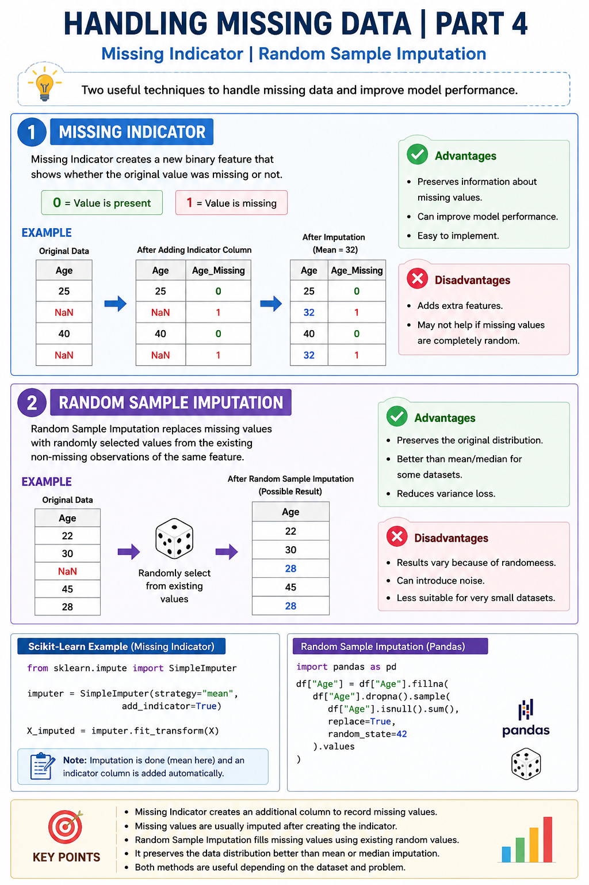

# Handling Missing Data | Part 4
## Missing Indicator | Random Sample Imputation



Missing values can reduce the quality of a machine learning model. Two useful techniques to handle them are **Missing Indicator** and **Random Sample Imputation**.

---

# 1. Missing Indicator

### What is Missing Indicator?
A **Missing Indicator** creates a new binary feature that records whether the original value was missing or not.

- Missing value → **1**
- Available value → **0**

The original missing values are then imputed using another method (Mean, Median, Mode, etc.), while the new indicator column preserves the missing information.

### Example

| Age | Age_Missing |
|-----|------------|
| 25 | 0 |
| NaN | 1 |
| 40 | 0 |
| NaN | 1 |

After imputing:

| Age | Age_Missing |
|-----|------------|
| 25 | 0 |
| 32 | 1 |
| 40 | 0 |
| 32 | 1 |

### Advantages
- Preserves information about missing values.
- Can improve model performance.
- Easy to implement in Scikit-Learn.

### Disadvantages
- Adds extra features.
- May not help if missing values are completely random.

---

# 2. Random Sample Imputation

### What is Random Sample Imputation?

Random Sample Imputation replaces missing values with randomly selected values from the existing non-missing observations of the same feature.

This helps maintain the original data distribution.

### Example

Original Data:

| Age |
|-----|
| 22 |
| 30 |
| NaN |
| 45 |
| 28 |

Possible Result:

| Age |
|-----|
| 22 |
| 30 |
| 28 |
| 45 |
| 28 |

(The missing value is replaced by a randomly selected existing value.)

### Advantages
- Preserves the original distribution.
- Better than mean/median for some datasets.
- Reduces variance loss.

### Disadvantages
- Results vary because of randomness.
- Can introduce noise.
- Less suitable for very small datasets.

---

# Scikit-Learn Example (Missing Indicator)

```python
from sklearn.impute import SimpleImputer

imputer = SimpleImputer(strategy="mean", add_indicator=True)

X_imputed = imputer.fit_transform(X)
```

---

# Random Sample Imputation (Pandas)

```python
import pandas as pd

df["Age"] = df["Age"].fillna(
    df["Age"].dropna().sample(
        df["Age"].isnull().sum(),
        replace=True,
        random_state=42
    ).values
)
```

---

# Key Points

- Missing Indicator creates an additional column to record missing values.
- Missing values are usually imputed after creating the indicator.
- Random Sample Imputation fills missing values using existing random values.
- It preserves the data distribution better than mean or median imputation.
- Both methods are useful depending on the dataset and machine learning problem.