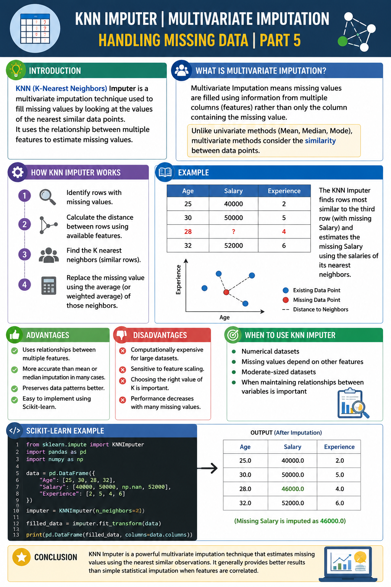

# KNN Imputer | Multivariate Imputation | Handling Missing Data | Part 5



## Introduction

KNN (K-Nearest Neighbors) Imputer is a multivariate imputation technique used to fill missing values by looking at the values of the nearest similar data points. Instead of using a single statistic like mean or median, it uses the relationship between multiple features to estimate missing values.

---

## What is Multivariate Imputation?

Multivariate Imputation means missing values are filled using information from **multiple columns (features)** rather than only the column containing the missing value.

Unlike univariate methods (Mean, Median, Mode), multivariate methods consider the similarity between data points.

---

## How KNN Imputer Works

1. Identify rows with missing values.
2. Calculate the distance between rows using available features.
3. Find the **K nearest neighbors** (similar rows).
4. Replace the missing value using the average (or weighted average) of those neighbors.

---

## Example

| Age | Salary | Experience |
|------|--------|------------|
| 25 | 40000 | 2 |
| 30 | 50000 | 5 |
| 28 | ? | 4 |
| 32 | 52000 | 6 |

The KNN Imputer finds rows most similar to the third row and estimates the missing Salary using the salaries of its nearest neighbors.

---

## Advantages

- Uses relationships between multiple features.
- More accurate than mean or median imputation in many cases.
- Preserves data patterns better.
- Easy to implement using Scikit-learn.

---

## Disadvantages

- Computationally expensive for large datasets.
- Sensitive to feature scaling.
- Choosing the right value of **K** is important.
- Performance decreases with many missing values.

---

## Scikit-learn Example

```python
from sklearn.impute import KNNImputer
import pandas as pd
import numpy as np

data = pd.DataFrame({
    "Age": [25, 30, 28, 32],
    "Salary": [40000, 50000, np.nan, 52000],
    "Experience": [2, 5, 4, 6]
})

imputer = KNNImputer(n_neighbors=2)

filled_data = imputer.fit_transform(data)

print(pd.DataFrame(filled_data, columns=data.columns))
```

---

## When to Use KNN Imputer

- Numerical datasets
- Missing values depend on other features
- Moderate-sized datasets
- When maintaining relationships between variables is important

---

## Conclusion

KNN Imputer is a powerful multivariate imputation technique that estimates missing values using the nearest similar observations. It generally provides better results than simple statistical imputation when features are correlated.