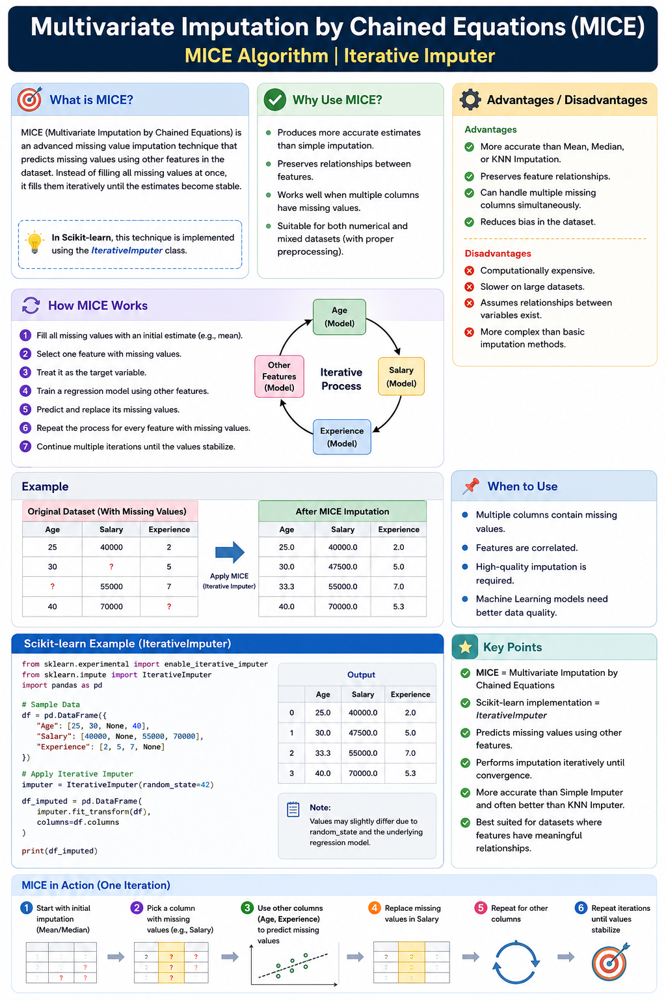

# Multivariate Imputation by Chained Equations (MICE) | Iterative Imputer



## 📌 What is MICE?

**MICE (Multivariate Imputation by Chained Equations)** is an advanced missing value imputation technique that predicts missing values using **other features** in the dataset. Instead of filling all missing values at once, it fills them **iteratively** until the estimates become stable.

In **Scikit-learn**, this technique is implemented using the **IterativeImputer** class.

---

## 🔹 Why Use MICE?

- Produces more accurate estimates than simple imputation.
- Preserves relationships between features.
- Works well when multiple columns have missing values.
- Suitable for both numerical and mixed datasets (with proper preprocessing).

---

## 🔹 How MICE Works

1. Fill all missing values with an initial estimate (e.g., mean).
2. Select one feature with missing values.
3. Treat it as the target variable.
4. Train a regression model using other features.
5. Predict and replace its missing values.
6. Repeat the process for every feature with missing values.
7. Continue multiple iterations until the values stabilize.

---

## 🔹 Example

Original Dataset

| Age | Salary | Experience |
|-----|--------|------------|
| 25 | 40000 | 2 |
| 30 | ? | 5 |
| ? | 55000 | 7 |
| 40 | 70000 | ? |

After applying MICE, each missing value is predicted using the remaining features instead of replacing it with a simple mean.

---

## 🔹 Advantages

- More accurate than Mean, Median, or KNN Imputation.
- Preserves feature relationships.
- Can handle multiple missing columns simultaneously.
- Reduces bias in the dataset.

---

## 🔹 Disadvantages

- Computationally expensive.
- Slower on large datasets.
- Assumes relationships between variables exist.
- More complex than basic imputation methods.

---

## 🔹 Scikit-learn Example

```python
from sklearn.experimental import enable_iterative_imputer
from sklearn.impute import IterativeImputer
import pandas as pd

df = pd.DataFrame({
    "Age": [25, 30, None, 40],
    "Salary": [40000, None, 55000, 70000],
    "Experience": [2, 5, 7, None]
})

imputer = IterativeImputer(random_state=42)

df_imputed = pd.DataFrame(
    imputer.fit_transform(df),
    columns=df.columns
)

print(df_imputed)
```

---

## 🔹 When to Use

- Multiple columns contain missing values.
- Features are correlated.
- High-quality imputation is required.
- Machine Learning models need better data quality.

---

# ✅ Key Points

- **MICE = Multivariate Imputation by Chained Equations**
- **Scikit-learn implementation = IterativeImputer**
- Predicts missing values using other features.
- Performs imputation iteratively until convergence.
- More accurate than Simple Imputer and often better than KNN Imputer.
- Best suited for datasets where features have meaningful relationships.