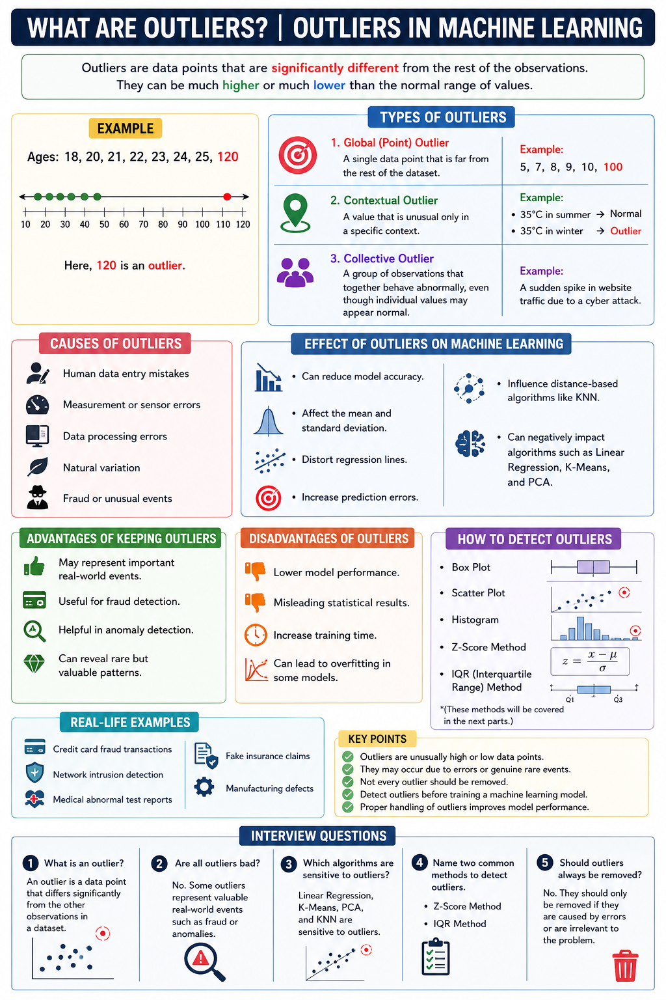

# What are Outliers? | Outliers in Machine Learning

Outliers are data points that are **significantly different** from the rest of the observations in a dataset. They can be much higher or much lower than the normal range of values.

Outliers are common in real-world datasets and can affect the performance of machine learning models, statistical analysis, and data visualization.

---

# Example

Suppose we have the following ages:

```
18, 20, 21, 22, 23, 24, 25, 120
```

Here, **120** is an **outlier** because it is far away from the other values.

---

# Types of Outliers

### 1. Global (Point) Outlier
A single data point that is far from the rest of the dataset.

**Example:**
```
5, 7, 8, 9, 10, 100
```

---

### 2. Contextual Outlier
A value that is unusual only in a specific context.

**Example:**
- Temperature of **35°C** is normal in summer.
- The same **35°C** in winter is an outlier.

---

### 3. Collective Outlier
A group of observations that together behave abnormally, even though individual values may appear normal.

**Example:**
A sudden spike in website traffic due to a cyber attack.

---

# Causes of Outliers

- Human data entry mistakes
- Measurement or sensor errors
- Data processing errors
- Natural variation
- Fraud or unusual events

---

# Effect of Outliers on Machine Learning

- Can reduce model accuracy.
- Affect the mean and standard deviation.
- Distort regression lines.
- Increase prediction errors.
- Influence distance-based algorithms like **KNN**.
- Can negatively impact algorithms such as **Linear Regression**, **K-Means**, and **PCA**.

---

# Advantages of Keeping Outliers

- May represent important real-world events.
- Useful for fraud detection.
- Helpful in anomaly detection.
- Can reveal rare but valuable patterns.

---

# Disadvantages of Outliers

- Lower model performance.
- Misleading statistical results.
- Increase training time.
- Can lead to overfitting in some models.

---

# How to Detect Outliers

- Box Plot
- Scatter Plot
- Histogram
- Z-Score Method
- IQR (Interquartile Range) Method

*(These methods will be covered in the next parts.)*

---

# Real-Life Examples

- Credit card fraud transactions
- Network intrusion detection
- Medical abnormal test reports
- Fake insurance claims
- Manufacturing defects

---

# Key Points

- Outliers are unusually high or low data points.
- They may occur due to errors or genuine rare events.
- Not every outlier should be removed.
- Detect outliers before training a machine learning model.
- Proper handling of outliers improves model performance.

---

# Interview Questions

### 1. What is an outlier?
An outlier is a data point that differs significantly from the other observations in a dataset.

### 2. Are all outliers bad?
No. Some outliers represent valuable real-world events such as fraud or anomalies.

### 3. Which algorithms are sensitive to outliers?
Linear Regression, K-Means, PCA, and KNN are sensitive to outliers.

### 4. Name two common methods to detect outliers.
- Z-Score Method
- IQR Method

### 5. Should outliers always be removed?
No. They should only be removed if they are caused by errors or are irrelevant to the problem.

