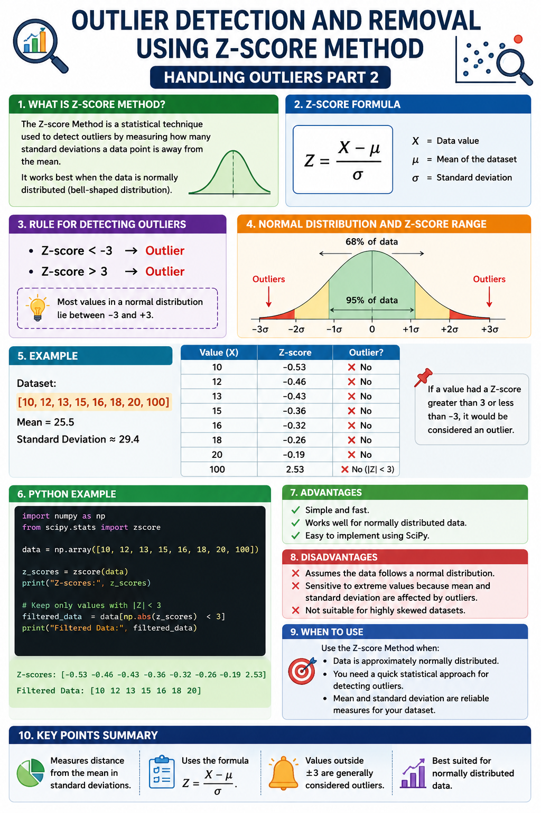

# Outlier Detection and Removal using Z-score Method | Handling Outliers Part 2



## 📌 What is the Z-score Method?

The **Z-score Method** is a statistical technique used to detect outliers by measuring how many standard deviations a data point is away from the mean.

It works best when the data is **normally distributed (bell-shaped distribution).**

---

## 📖 Z-score Formula

\[
Z = \frac{X - \mu}{\sigma}
\]

Where:

- **X** = Data value
- **μ** = Mean of the dataset
- **σ** = Standard deviation

---

## 🎯 Rule for Detecting Outliers

- **Z-score < -3** → Outlier
- **Z-score > 3** → Outlier

Most values in a normal distribution lie between **-3 and +3**.

---

## 🛠 Example

Dataset:

```
[10, 12, 13, 15, 16, 18, 20, 100]
```

- Mean = 25.5
- Standard Deviation ≈ 29.4

| Value | Z-score | Outlier |
|-------:|---------:|:--------|
| 10 | -0.53 | ❌ No |
| 12 | -0.46 | ❌ No |
| 13 | -0.43 | ❌ No |
| 15 | -0.36 | ❌ No |
| 16 | -0.32 | ❌ No |
| 18 | -0.26 | ❌ No |
| 20 | -0.19 | ❌ No |
| 100 | 2.53 | ❌ No (using ±3 rule) |

> If a value had a Z-score greater than **3** or less than **-3**, it would be considered an outlier.

---

## 💻 Python Example

```python
import numpy as np
from scipy.stats import zscore

data = np.array([10, 12, 13, 15, 16, 18, 20, 100])

z_scores = zscore(data)

print(z_scores)

# Keep only values with |Z| < 3
filtered_data = data[np.abs(z_scores) < 3]

print(filtered_data)
```

---

## ✅ Advantages

- Simple and fast.
- Works well for normally distributed data.
- Easy to implement using SciPy.

---

## ❌ Disadvantages

- Assumes the data follows a normal distribution.
- Sensitive to extreme values because mean and standard deviation are affected by outliers.
- Not suitable for highly skewed datasets.

---

## 📌 When to Use

Use the **Z-score Method** when:

- Data is approximately normally distributed.
- You need a quick statistical approach for detecting outliers.
- Mean and standard deviation are reliable measures for your dataset.

---

## 🔥 Key Points

- Measures distance from the mean in standard deviations.
- Uses the formula **Z = (X − μ) / σ**.
- Values outside **±3** are generally considered outliers.
- Best suited for normally distributed data.