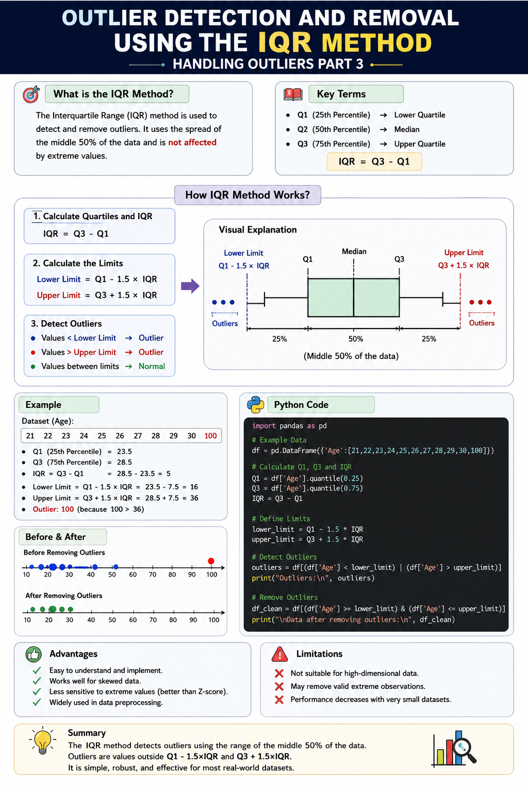

# Outlier Detection and Removal using the IQR Method | Handling Outliers Part 3



## 📌 What is the IQR Method?

The **Interquartile Range (IQR)** method is a statistical technique used to detect and remove **outliers** from a dataset. It works by identifying values that lie far below or above the middle 50% of the data.

It is more robust than the Z-score method because it is **not affected by extreme values**.

---

## 📊 What is IQR?

The **Interquartile Range (IQR)** is the difference between the third quartile (Q3) and the first quartile (Q1).

**Formula:**

```python
IQR = Q3 - Q1
```

- **Q1 (25th Percentile)** → Lower Quartile
- **Q2 (50th Percentile)** → Median
- **Q3 (75th Percentile)** → Upper Quartile

---

## 📌 Outlier Detection Rule

Calculate the lower and upper limits:

```python
Lower Limit = Q1 - 1.5 × IQR
Upper Limit = Q3 + 1.5 × IQR
```

Any value:

- Less than the Lower Limit → Outlier
- Greater than the Upper Limit → Outlier

---

## 🐍 Python Example

```python
import pandas as pd

# Calculate quartiles
Q1 = df["Age"].quantile(0.25)
Q3 = df["Age"].quantile(0.75)

# Calculate IQR
IQR = Q3 - Q1

# Define limits
lower_limit = Q1 - 1.5 * IQR
upper_limit = Q3 + 1.5 * IQR

# Detect outliers
outliers = df[(df["Age"] < lower_limit) | (df["Age"] > upper_limit)]

print(outliers)
```

---

## 🗑️ Remove Outliers

```python
df_clean = df[
    (df["Age"] >= lower_limit) &
    (df["Age"] <= upper_limit)
]

print(df_clean.head())
```

---

## ✅ Advantages

- Easy to understand and implement.
- Works well for skewed data.
- Less sensitive to extreme values than Z-score.
- Widely used in data preprocessing.

---

## ❌ Limitations

- Not suitable for high-dimensional data.
- May remove valid extreme observations.
- Performance decreases with very small datasets.

---

## 📌 Summary

- IQR measures the spread of the middle 50% of data.
- Outliers are values outside **Q1 − 1.5×IQR** and **Q3 + 1.5×IQR**.
- More reliable than Z-score for skewed distributions.
- Commonly used before training Machine Learning models.

---
### 🚀 Git Commit Message

```bash
git commit -m "Add notes on Outlier Detection using IQR Method"
```