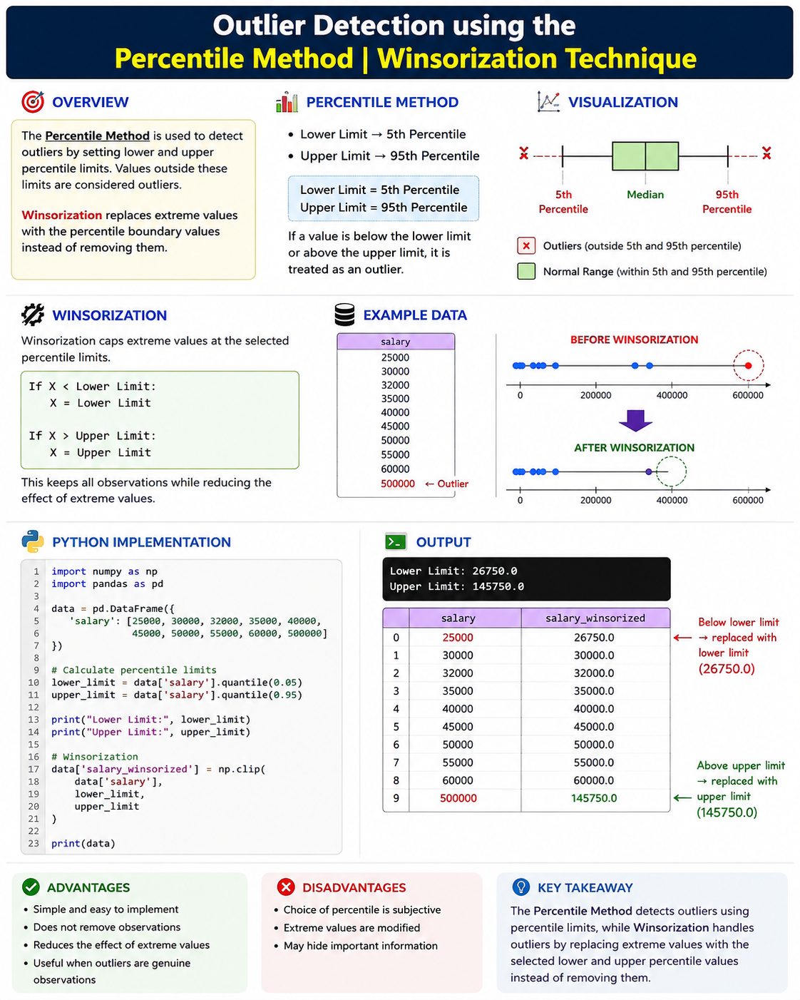

```markdown
# Outlier Detection using the Percentile Method | Winsorization Technique



## Overview

The Percentile Method is used to detect outliers by defining lower and upper percentile limits. Values outside these limits are considered outliers.

Winsorization handles these outliers by replacing extreme values with the selected percentile boundary values instead of removing them.

## Percentile Method

Commonly used percentile limits:

- Lower Limit → 5th Percentile
- Upper Limit → 95th Percentile

```text
Lower Limit = 5th Percentile
Upper Limit = 95th Percentile
```

If a value is below the lower limit or above the upper limit, it is treated as an outlier.

## Winsorization

Winsorization caps extreme values at the selected percentile limits.

```text
If X < Lower Limit:
    X = Lower Limit

If X > Upper Limit:
    X = Upper Limit
```

This keeps all observations while reducing the effect of extreme values.

## Python Implementation

```python
import numpy as np
import pandas as pd

# Example data
data = pd.DataFrame({
    'salary': [25000, 30000, 32000, 35000, 40000,
               45000, 50000, 55000, 60000, 500000]
})

# Calculate percentile limits
lower_limit = data['salary'].quantile(0.05)
upper_limit = data['salary'].quantile(0.95)

print("Lower Limit:", lower_limit)
print("Upper Limit:", upper_limit)

# Winsorization
data['salary_winsorized'] = np.clip(
    data['salary'],
    lower_limit,
    upper_limit
)

print(data)
```

## Advantages

- Simple and easy to implement
- Does not remove observations
- Reduces the effect of extreme values
- Useful when outliers are genuine observations

## Disadvantages

- Choice of percentile is subjective
- Extreme values are modified
- May hide important information

## Key Takeaway

The **Percentile Method** detects outliers using percentile limits, while **Winsorization** handles outliers by replacing extreme values with the selected lower and upper percentile values instead of removing them.
```