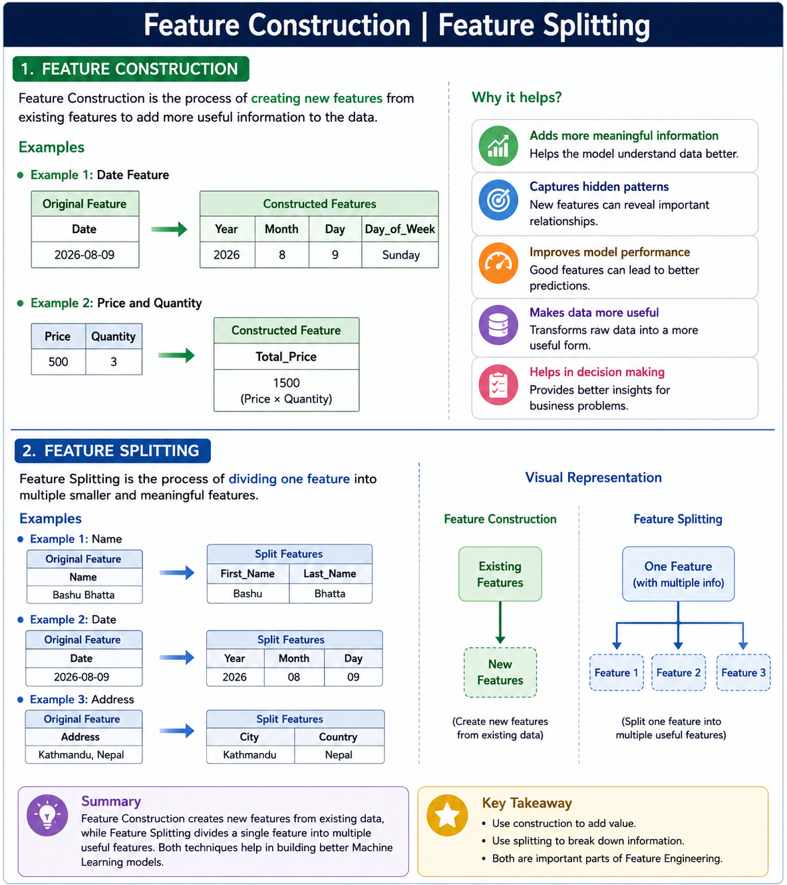

# Feature Construction | Feature Splitting

## Feature Construction

Feature Construction is the process of creating new features from existing features in a dataset. It is an important part of Feature Engineering because existing data may not always contain the information in the best form for a Machine Learning model.

New features can be created by combining, transforming, or extracting useful information from existing features.

### Example

Suppose we have:

`Date = 2026-08-09`

We can construct new features such as:

- `Day = 9`
- `Month = 8`
- `Year = 2026`
- `Day_of_Week = Sunday`

These new features can provide more useful information to the Machine Learning model.

Another example:

`Price = 500`  
`Quantity = 3`

We can construct:

`Total_Price = Price × Quantity`

`Total_Price = 500 × 3 = 1500`

---

## Feature Splitting

Feature Splitting is the process of dividing one feature into multiple smaller and meaningful features.

Sometimes a single column contains multiple pieces of information. Splitting that column allows us to use each part separately.

### Example 1: Name

Suppose we have:

`Name = "Bashu Bhatta"`

We can split it into:

- `First_Name = Bashu`
- `Last_Name = Bhatta`

### Example 2: Date

Suppose we have:

`Date = 2026-08-09`

It can be split into:

- `Year = 2026`
- `Month = 08`
- `Day = 09`

### Example 3: Address

Suppose we have:

`Address = "Kathmandu, Nepal"`

It can be split into:

- `City = Kathmandu`
- `Country = Nepal`

---

## Benefits

- Creates more meaningful features.
- Extracts useful information from existing data.
- Helps Machine Learning models identify patterns.
- Makes data easier to analyze.
- Can improve model performance.
- Reduces unnecessary complexity in individual features.

## Summary

**Feature Construction** creates new features from existing data, while **Feature Splitting** divides a single feature containing multiple pieces of information into separate useful features.

Both techniques are important parts of **Feature Engineering** and help prepare data for better Machine Learning models.