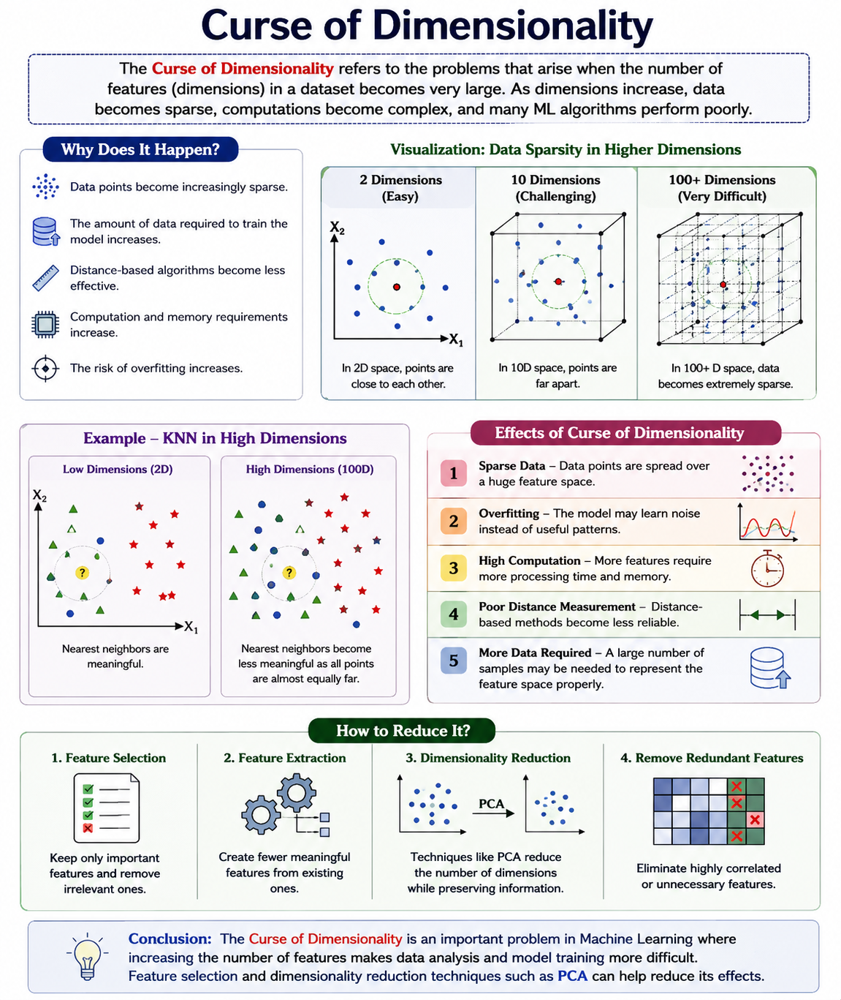

# Curse of Dimensionality

## Definition
The **Curse of Dimensionality** refers to the problems that occur when the number of features (dimensions) in a dataset becomes very large. As dimensions increase, the data becomes sparse, calculations become more complex, and many Machine Learning algorithms perform poorly.

## Why Does It Happen?
When the number of features increases:
- Data points become increasingly sparse.
- The amount of data required to train the model increases.
- Distance-based algorithms become less effective.
- Computation and memory requirements increase.
- The risk of **overfitting** increases.

## Example
Suppose we have:
- 2 features → data can be easily represented on a 2D graph.
- 10 features → data exists in a 10-dimensional space.
- 100+ features → the space becomes extremely large and data points become very sparse.

For example, in **KNN**, finding the nearest data points becomes difficult because distances between points become more similar as the number of dimensions increases.

## Effects of Curse of Dimensionality
1. **Sparse Data** – Data points are spread over a huge feature space.
2. **Overfitting** – The model may learn noise instead of useful patterns.
3. **High Computation** – More features require more processing time and memory.
4. **Poor Distance Measurement** – Distance-based methods become less reliable.
5. **More Data Required** – A large number of samples may be needed to represent the feature space properly.

## How to Reduce It?
The curse of dimensionality can be reduced using:
- **Feature Selection** – Keep only important features.
- **Feature Extraction** – Create fewer meaningful features from existing ones.
- **Dimensionality Reduction** – Techniques such as **PCA** reduce the number of dimensions.
- **Removing Redundant Features** – Eliminate highly correlated or unnecessary features.

## Conclusion
The Curse of Dimensionality is an important problem in Machine Learning where increasing the number of features makes data analysis and model training more difficult. **Feature selection and dimensionality reduction techniques such as PCA** can help reduce its effects.

