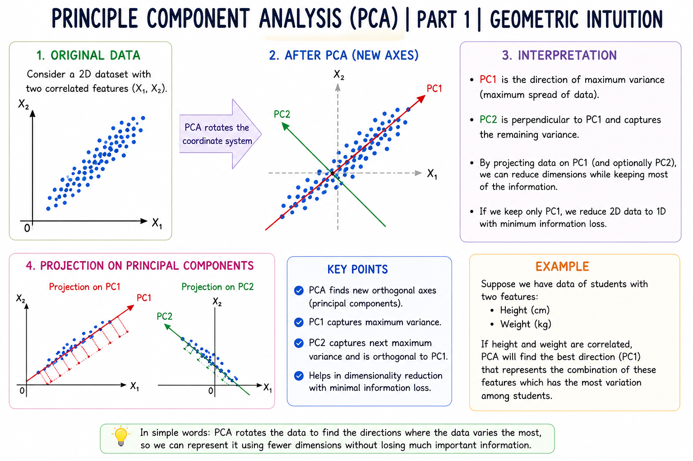

# Principle Component Analysis (PCA) | Part 1 | Geometric Intuition

Principal Component Analysis (PCA) is a dimensionality reduction technique used in Machine Learning to reduce the number of features while preserving as much useful information as possible.

## What is PCA?

PCA transforms the original features into a new set of features called **Principal Components**. These components are arranged according to the amount of variance (information) they capture from the data.

The first principal component captures the maximum possible variance in the data. The second principal component captures the next highest variance and is perpendicular to the first component.

## Geometric Intuition

Consider a dataset with two features plotted on a graph. The data points may be spread mainly in one particular direction.

PCA finds a new axis along the direction where the data has the **maximum spread or variance**. This axis becomes the **First Principal Component (PC1)**.

A second axis is then chosen perpendicular to PC1. This becomes the **Second Principal Component (PC2)**.

Instead of representing the data using the original X and Y axes, PCA represents it using these new principal component axes.

## Why is Variance Important?

Variance tells us how much the data is spread out.

- Higher variance → More information
- Lower variance → Less information

PCA tries to find directions that contain the maximum variance so that important information is retained even after reducing dimensions.

## Example

Suppose a dataset has two features:

- Height
- Weight

If the data points are mostly distributed along a diagonal direction, PCA can find that direction as PC1.

The original two features can then be represented using the new principal components, making the data easier to visualize and potentially reducing its dimensions.

## Key Points

- PCA is mainly used for **Dimensionality Reduction**.
- It creates new features called **Principal Components**.
- PC1 captures the maximum variance.
- Each successive component captures the remaining maximum variance.
- Principal components are perpendicular to each other.
- PCA is based on the geometric idea of finding the best directions of data spread.

## Conclusion

The geometric intuition behind PCA is to rotate the coordinate system so that the new axes align with the directions where the data varies the most. This allows us to represent high-dimensional data using fewer dimensions while keeping the most important information.

