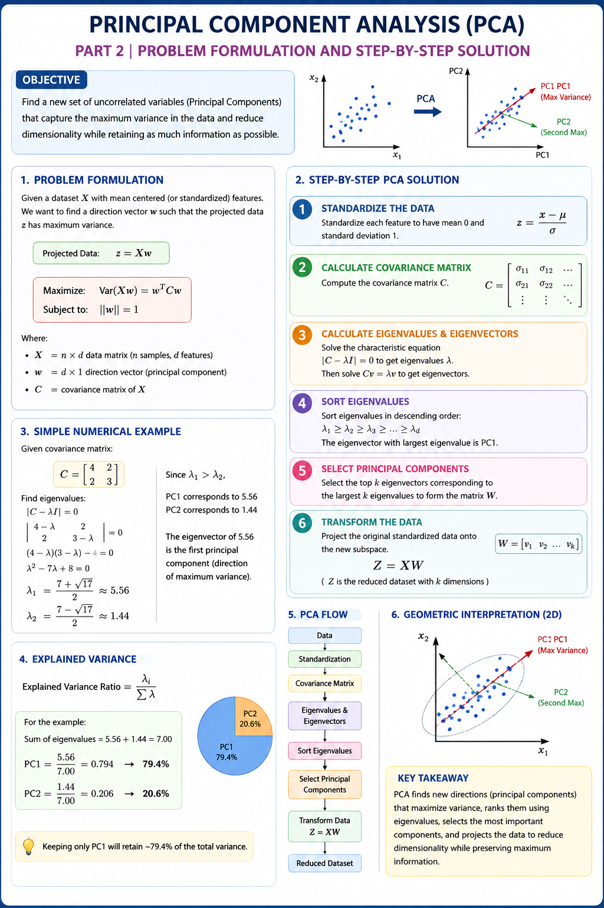

# Principal Component Analysis (PCA) | Part 2 | Problem Formulation and Step-by-Step Solution

## Overview
Principal Component Analysis (PCA) is a dimensionality reduction technique used to transform a dataset with many features into a smaller number of new features called Principal Components.

In Part 2, we focus on the mathematical problem formulation of PCA and understand how PCA is solved step by step.

## Problem Formulation
The main objective of PCA is to find a direction in which the projected data has maximum variance.

For a direction vector `w`, the projected data is:

`Z = Xw`

PCA maximizes:

`Var(Xw)`

subject to:

`||w|| = 1`

The constraint ensures that the direction vector has unit length.

## Step-by-Step PCA Solution

### 1. Standardize the Data
Standardize the features so that they have mean 0 and standard deviation 1.

`z = (x - μ) / σ`

### 2. Calculate the Covariance Matrix
The covariance matrix shows the variance of individual features and the relationship between different features.

### 3. Calculate Eigenvalues and Eigenvectors
Solve the characteristic equation:

`|C - λI| = 0`

This gives the eigenvalues.

Then solve:

`Cv = λv`

to obtain the corresponding eigenvectors.

### 4. Sort Eigenvalues
Arrange the eigenvalues from largest to smallest.

- Largest eigenvalue → Principal Component 1 (PC1)
- Second largest → Principal Component 2 (PC2)
- And so on.

### 5. Select Principal Components
Select the eigenvectors corresponding to the largest eigenvalues depending on the required reduced dimensions.

### 6. Transform the Data
Project the standardized data onto the selected eigenvectors:

`Z = XW`

The resulting `Z` is the reduced-dimensional dataset.

## Explained Variance
The amount of variance captured by each principal component is calculated using:

`Explained Variance Ratio = λᵢ / Σλ`

A component with a larger eigenvalue preserves more information from the original dataset.

## Key Takeaway
PCA finds new directions that maximize variance, ranks them using eigenvalues, selects the most important principal components, and projects the original data onto those components to reduce dimensionality while preserving maximum information.

## PCA Flow

Data  
↓  
Standardization  
↓  
Covariance Matrix  
↓  
Eigenvalues & Eigenvectors  
↓  
Sort Eigenvalues  
↓  
Select Principal Components  
↓  
Transform Data  
↓  
Reduced Dataset