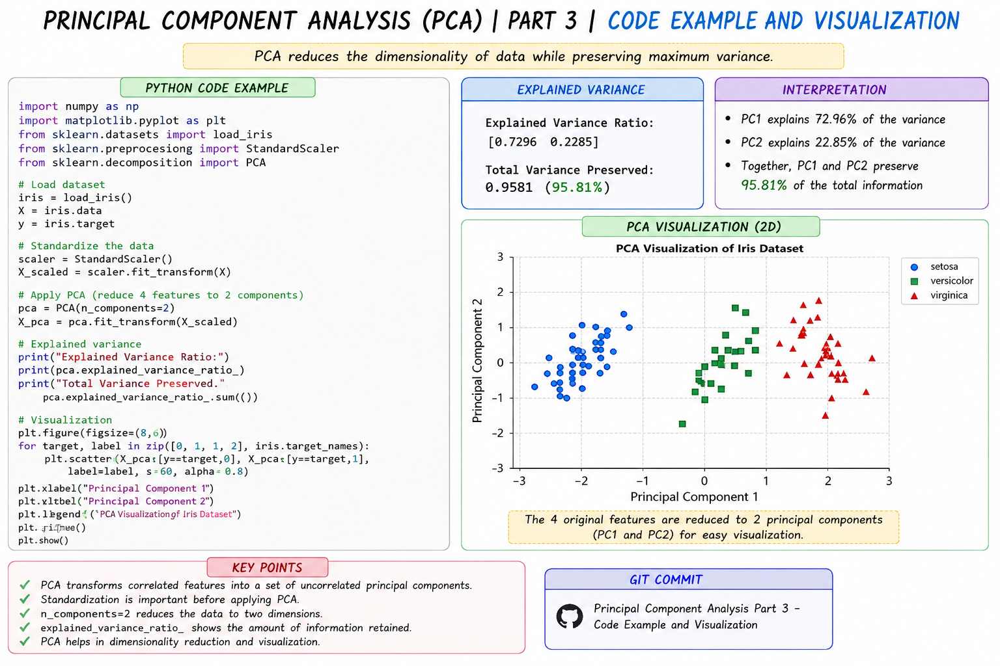

# Principal Component Analysis (PCA) | Part 3 | Code Example and Visualization



## Introduction

In this part, we implement **Principal Component Analysis (PCA)** using Python and Scikit-learn. After understanding the theory and mathematical formulation of PCA, we now apply it practically to a dataset and visualize the reduced dimensions.

## Code Example

```python
import numpy as np
import matplotlib.pyplot as plt
from sklearn.datasets import load_iris
from sklearn.preprocessing import StandardScaler
from sklearn.decomposition import PCA

# Load the Iris dataset
iris = load_iris()
X = iris.data
y = iris.target

# Standardize the data
scaler = StandardScaler()
X_scaled = scaler.fit_transform(X)

# Apply PCA and reduce 4 features to 2 components
pca = PCA(n_components=2)
X_pca = pca.fit_transform(X_scaled)

# Display explained variance
print("Explained Variance Ratio:")
print(pca.explained_variance_ratio_)

print("Total Variance Preserved:",
      pca.explained_variance_ratio_.sum())

# Visualize the Principal Components
plt.figure(figsize=(8, 6))

for target, label in zip([0, 1, 2], iris.target_names):
    plt.scatter(
        X_pca[y == target, 0],
        X_pca[y == target, 1],
        label=label
    )

plt.xlabel("Principal Component 1")
plt.ylabel("Principal Component 2")
plt.title("PCA Visualization")
plt.legend()
plt.show()